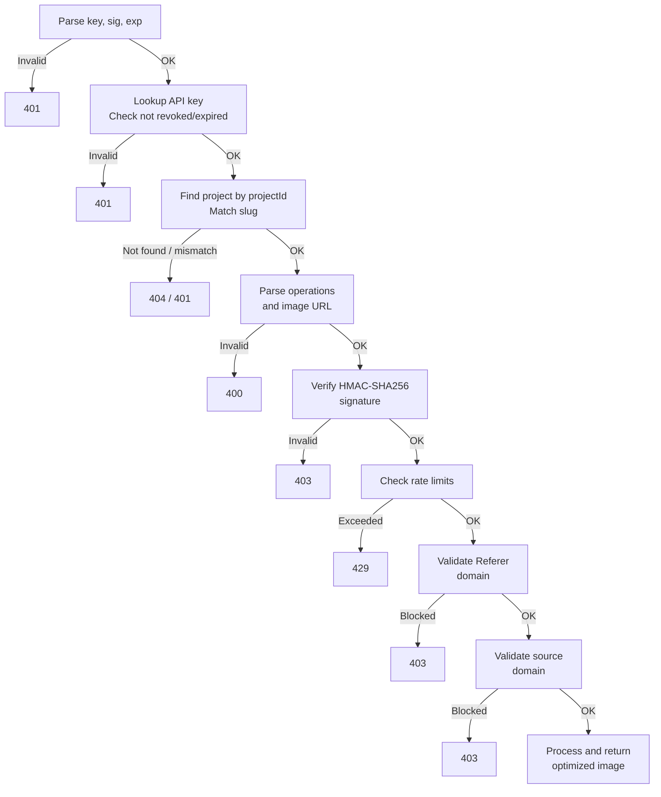

OptStuff exposes a single REST endpoint for image optimization. All transformations, authentication, and caching are encoded in the URL. For a step-by-step integration tutorial, see the [Integration Guide](/getting-started/integration-guide).

## Endpoint Format

```
GET /api/v1/{projectSlug}/{operations}/{imageUrl}?key={publicKey}&sig={signature}&exp={expiresAt}
```

## Path Parameters

| Parameter | Description | Example |
|-----------|-------------|---------|
| `projectSlug` | Your project identifier | `my-blog` |
| `operations` | Image operations (comma-separated), or `_` for none | `w_800,f_webp` |
| `imageUrl` | Source image URL (without protocol) | `cdn.example.com/photo.jpg` |

## Query Parameters

| Parameter | Required | Description |
|-----------|----------|-------------|
| `key` | Yes | Public key (e.g., `pk_abc123`) |
| `sig` | Yes | HMAC-SHA256 signature (see [URL Signing](/guides/url-signing)) |
| `exp` | No | Expiration timestamp (Unix seconds) |

## Example Request

```
GET /api/v1/my-blog/w_800,f_webp/images.example.com/photo.jpg?key=pk_abc123&sig=xyz789&exp=1706500000
```

## Response

### Success (200)

Returns the optimized image binary with long-lived caching headers:

```text
HTTP/1.1 200 OK
Content-Type: image/webp
Cache-Control: public, s-maxage=31536000, max-age=31536000, immutable
X-Processing-Time: 42ms
```

| Header | Description |
|--------|-------------|
| `Content-Type` | Output format (`image/webp`, `image/avif`, `image/png`, `image/jpeg`) |
| `Cache-Control` | 1-year cache with `immutable` |
| `X-Processing-Time` | Server-side processing time in milliseconds |

Image optimization URLs are **content-addressable**: the URL encodes all parameters and a signature, so the same URL always produces the same output. This makes the 1-year cache duration safe — changing any parameter produces a different URL.

### Errors

| Status | Cause |
|--------|-------|
| 400 | Invalid URL format or image URL |
| 401 | Missing/invalid/revoked/expired API key |
| 403 | Invalid signature, forbidden referer, or blocked source domain |
| 404 | Project not found |
| 429 | Rate limit exceeded |
| 500 | Image processing failed |

For the full error reference, see [Error Codes](/api-reference/error-codes).

## Authentication Flow

When a request arrives, the server validates it in this order:



| Step | Check | Failure |
|------|-------|---------|
| 1 | Parse `key`, `sig`, `exp` from query string | `401` |
| 2 | Look up API key; check not revoked/expired | `401` |
| 3 | Find project by key's `projectId`; match slug | `404` / `401` |
| 4 | Parse operations and image URL from path | `400` |
| 5 | Verify HMAC-SHA256 signature (constant-time) | `403` |
| 6 | Check rate limits | `429` |
| 7 | Validate Referer header against project domains | `403` |
| 8 | Validate image source domain against project's domains | `403` |
| 9 | Process and return optimized image | `500` |

> Rate limiting is checked **after** signature verification so that invalid requests cannot exhaust quota.

## Related Documentation

- [Image Operations](/api-reference/image-operations) — Full list of supported transformations
- [Error Codes](/api-reference/error-codes) — Complete error reference with troubleshooting
- [URL Signing](/guides/url-signing) — How to generate signatures
- [Integration Guide](/getting-started/integration-guide) — Step-by-step integration
