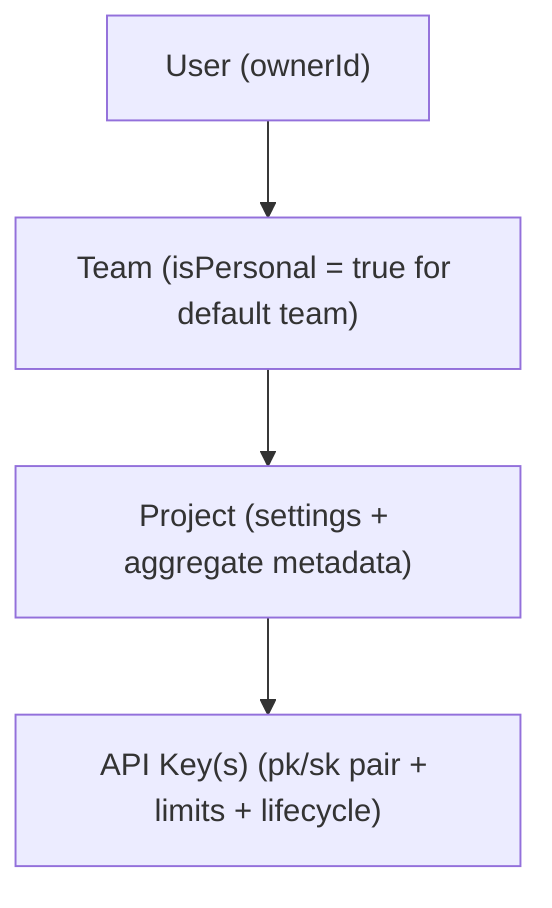

This page explains how the **control plane** is built: the data model, ownership boundaries, and the write paths that provision runtime configuration.

## Core Tenancy Model

### Ownership boundary

- Team is the primary ownership boundary.
- Projects belong to a team.
- API keys belong to a project.
- Protected procedures verify access at team/project scope before writes.

## Control Plane Responsibilities

| Area | What it does |
|---|---|
| Onboarding | Ensure each user has one personal team |
| Project provisioning | Create project + default API key in one flow |
| API key lifecycle | Create, rotate, revoke, update metadata |
| Domain policy management | Update allowed source/referer domains per project |
| Cache coherence | Invalidate Redis config cache after control-plane mutations |

## Data Constraints that enforce design

| Table | Constraint | Why it matters |
|---|---|---|
| `team` | `slug` unique globally | Stable, human-readable URLs |
| `team` | unique `(ownerId)` where `isPersonal = true` | Exactly one personal team per user |
| `project` | unique `(teamId, slug)` | Team-scoped project identity |
| `api_key` | `publicKey` unique | Fast, unambiguous lookup in runtime path |

## Project Provisioning Flow

When creating a project from dashboard:

1. Verify team access.
2. Generate team-scoped unique project slug.
3. Insert `project` (with domain settings if provided).
4. Generate default `pk_...` + `sk_...`.
5. Encrypt secret key (`AES-256-GCM` with HKDF-derived key).
6. Store encrypted secret in `api_key.secretKey`.
7. Return `defaultApiKey` + plaintext `defaultSecretKey` once.

<Callout type="warn">
**Warning:** `defaultSecretKey` is shown only once during this response. Copy and store it immediately in your secrets manager or environment variables, because it cannot be retrieved again later.
</Callout>

This is why users can start integration immediately after first project creation.

## API Key Lifecycle Model

### Create
- Generates new key pair.
- Stores encrypted secret.
- Returns plaintext secret once.

### Rotate
- Transaction: revoke old key + insert new key atomically.
- Inherits name/expiration/rate limits.
- Invalidates old key cache best-effort.

### Revoke / Update
- Marks key revoked or edits metadata.
- Invalidates cache best-effort so runtime picks up changes quickly.

## Access Control Shape

- Dashboard and tRPC procedures run authenticated.
- Runtime image route `/api/v1/...` is intentionally service-facing and bypasses dashboard auth middleware.
- Runtime auth is enforced with signed URLs + API key + project/domain/rate-limit checks.

This separation keeps integration traffic independent from dashboard session state.

## Control Plane -> Data Plane handoff

Control plane writes **runtime policy data** consumed by the image route:

- `allowedSourceDomains`
- `allowedRefererDomains`
- key expiry/revocation
- per-key minute/day limits

Data plane reads these via cache-aside (`config-cache.ts`) with:

- positive TTL: 60s
- negative TTL: 10s
- manual invalidation on key/project mutations

## Why this design scales

- **Clear ownership hierarchy** simplifies authorization and support.
- **Per-project policy + per-key auth/rate limits** balances control granularity.
- **Encrypted secret at rest + one-time reveal** reduces blast radius.
- **Best-effort cache invalidation + TTL fallback** prioritizes availability.

## Related Docs

- [Architecture Overview](/architecture/overview)
- [User Onboarding Flow](/architecture/user-onboarding-flow)
- [Create API Key Flow](/architecture/create-api-key-flow)
- [Redis Schema](/architecture/redis-schema)
