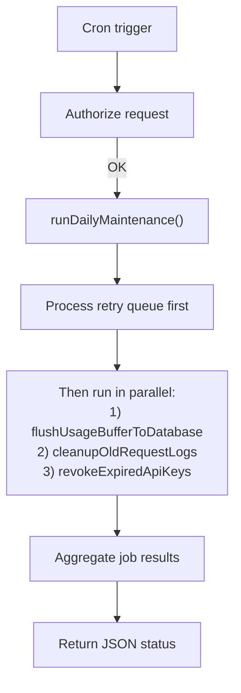

This page describes the `/api/cron/daily-maintenance` pipeline and explains why each step is implemented this way.

## Trigger and schedule

The job is triggered by Vercel Cron:

- Path: `/api/cron/daily-maintenance`
- Schedule: `0 3 * * *` (once per day)

In production, the route requires `CRON_SECRET` (Bearer token). In non-production, it allows local/manual invocation without the secret.

## Design goals

The cron pipeline optimizes for:

1. **Correct core state first**: key revocation must be durable and idempotent.
2. **Best-effort side effects**: denormalized counts and cache invalidation should not block the whole run.
3. **Recoverability**: failed side effects are persisted and retried later.
4. **Low operational overhead**: one daily cron can handle all periodic work on Vercel Free/Hobby.
5. **Upgrade-friendly design**: usage flush is exposed separately so higher-frequency schedules can be added later.

For low-frequency environments, operators can also trigger a protected manual usage flush from the dashboard without changing the scheduled architecture.

## End-to-end pipeline

## Step 1: Process retry queue first

Before running new maintenance work, the cron processes due entries in `maintenance_retry_task`.

Each retry task contains:

- `taskType`: what operation to retry
  - `sync_project_api_key_count`
  - `invalidate_api_key_cache`
- `taskKey`: target identifier (`projectId` or `publicKey`)
- `attempts`, `maxAttempts`
- `nextRunAt`, `lastError`

### Why run retries first

- Prevents old failures from being starved by new work.
- Helps keep denormalized/cached state converged over time.
- Keeps behavior deterministic for operators: "old debt first, then fresh work."

### Retry behavior

- Due tasks (`nextRunAt <= now` and `attempts < maxAttempts`) are processed in batches.
- Success removes the task from the queue.
- Failure increments `attempts`, stores `lastError`, and schedules next attempt with exponential backoff.
- Exhausted tasks (`attempts >= maxAttempts`) stay recorded and stop auto-running until re-enqueued by a new failure event.

## Step 2A: Usage buffer flush

`flushUsageBufferToDatabase()` moves Redis minute buckets into `usage_record`.

### Why this runs in daily cron

- Supports free-tier environments that can only schedule one cron job.
- Keeps authoritative usage metrics (`usage_record`) up to date without requiring a second scheduler.
- Still keeps the request path non-blocking by buffering writes in Redis first.

## Step 2B: Request log cleanup

`cleanupOldRequestLogs()` deletes logs older than retention and returns `deletedCount`.

### Why return deleted count

- Gives an immediate operational signal ("did cleanup do work this run?").
- Makes cron output more useful for monitoring and debugging.

## Step 2C: Expired API key sweep

`revokeExpiredApiKeys()` executes:

1. Select active keys where `expiresAt <= now` and `revokedAt IS NULL`.
2. Bulk update them with `revokedAt = now`.
3. Recompute `project.apiKeyCount` for affected projects.
4. Invalidate cache entries for revoked public keys.

### Why this ordering

- Revocation is the source-of-truth state transition, so it happens first.
- Count sync and cache invalidation are side effects; they can fail independently.
- Side-effect failures are captured into retry tasks instead of aborting all work.

### Failure model

- Project count sync uses `Promise.allSettled`: one project failure does not short-circuit others.
- Cache invalidation also uses `Promise.allSettled`.
- Rejected items are:
  - Logged with target identifier and error
  - Enqueued into `maintenance_retry_task` for future retry

This provides eventual convergence without requiring external workers/queues.

## Result contract

`runDailyMaintenance()` returns structured per-job status:

- `retryQueue`: processed/succeeded/failed/exhausted/remaining
- `usageBufferFlush`: scanned/processed keys, upserted rows, counters, and failures
- `requestLogCleanup`: `ok` + `deletedCount`
- `expiredApiKeySweep`: `ok` + `expiredKeys` + `affectedProjects` + `queuedRetryTasks`
- top-level `ok` and `durationMs`

This shape keeps the endpoint machine-readable for alerting and human-readable for incident triage.

## Why this fits Vercel Free/Hobby

- Uses one scheduled cron route and Postgres only (no extra queue infrastructure).
- Avoids single-point short-circuit failures on batch side effects.
- Supports eventual repair by retry queue + next cron execution.
- Maintains idempotent core updates (`revokedAt IS NULL` guard) for safe re-runs.

## Trade-offs and future upgrades

Current trade-offs:

- Side effects are eventually consistent, not strongly consistent.
- Exhausted retries require operator visibility (monitoring is important).

Potential future upgrades:

- Dedicated reconciliation job (periodic full `apiKeyCount` rebuild).
- Separate dead-letter handling UI/reporting for exhausted tasks.
- Distributed lock to prevent overlapping cron executions under high latency.
- Re-enable a higher-frequency schedule for `/api/cron/flush-usage-buffer` when plan limits allow.
