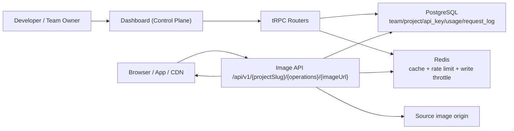

If you want a complete mental model of OptStuff, read this page first. It gives you the big picture and an efficient reading path across the Architecture section.

## One-Screen Mental Model

OptStuff has two major planes:

1. **Control Plane (Dashboard + tRPC)**  
   Teams, projects, API keys, domain settings, and onboarding workflows.
2. **Data Plane (Image API `/api/v1/...`)**  
   Signed request validation, source fetch, image transform, rate limiting, logging, and usage tracking.

## Build Sequence (Recommended Learning Order)

If you want to understand **how the system was built up end-to-end**, follow this order:

1. [System Overview](/architecture/system-overview)  
   End-to-end architecture, validation order, security boundaries, and key components.
2. [Control Plane and Multi-Tenancy](/architecture/control-plane-and-tenancy)  
   How teams/projects/API keys are modeled and managed.
3. [User Onboarding Flow](/architecture/user-onboarding-flow)  
   How a new user becomes an active project owner with first key in minutes.
4. [Create API Key Flow](/architecture/create-api-key-flow)  
   Dual-key model, one-time secret exposure, encryption-at-rest, and rotation behavior.
5. [Request Lifecycle](/architecture/request-lifecycle)  
   Request-by-request runtime path for `GET` and `HEAD`, including background tasks.
6. [Redis Schema](/architecture/redis-schema)  
   Cache-aside, negative cache, rate-limit counters, and write throttling details.
7. [SSRF Prevention: Image Proxy Design](/architecture/ssrf-prevention)  
   Threat model and the redirect-handling invariant that protects outbound fetches.

## What You Should Know After Reading

After completing the sequence above, you should be able to answer:

- How a team/project/API key is created and enforced at runtime.
- Why request validation is ordered the way it is.
- How Redis is used without becoming a data source of truth.
- What happens when Redis fails (and why availability is preserved).
- How domain policies and SSRF protections are enforced at the fetch boundary.

## Supporting Public Docs

For integration and consumer-facing behavior, pair this Architecture set with:

- [API Endpoint](/api-reference/endpoint)
- [Rate Limiting](/guides/rate-limiting)
- [URL Signing](/guides/url-signing)
- [Security Best Practices](/guides/security-best-practices)
