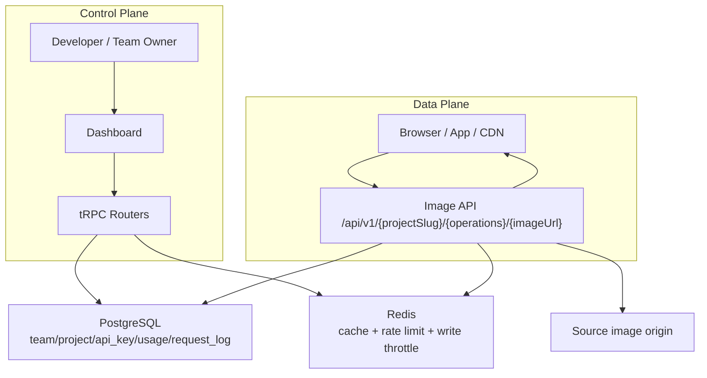
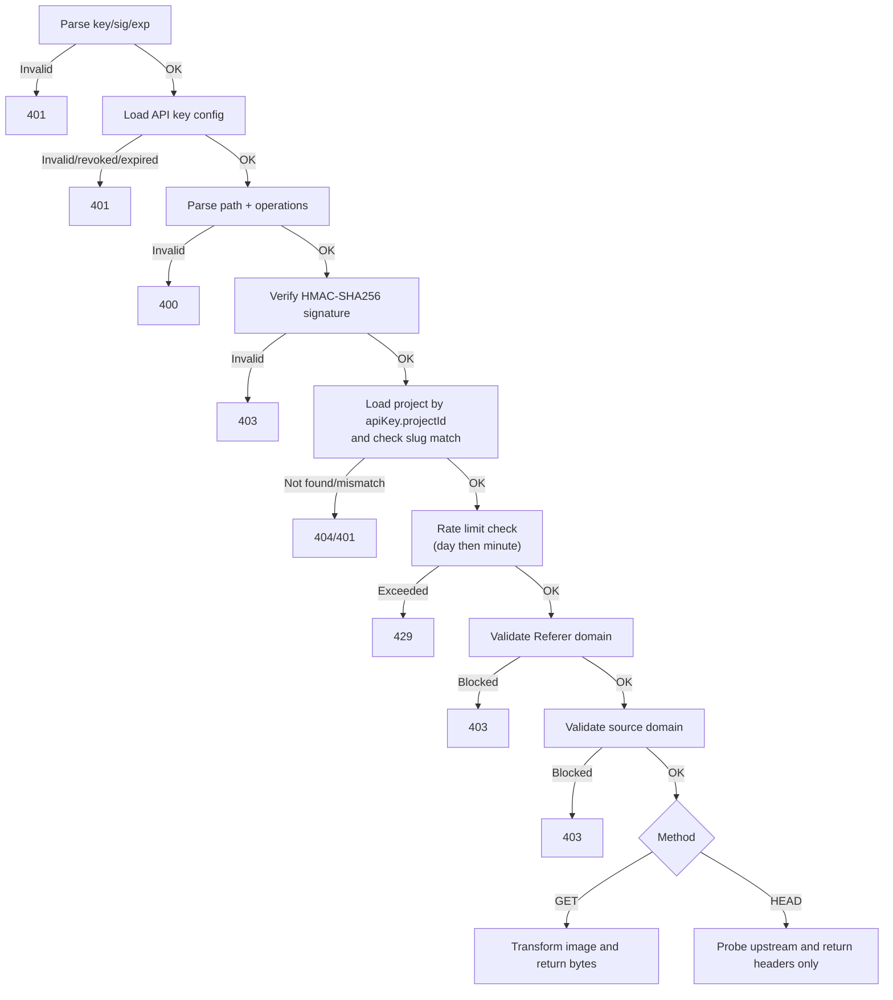
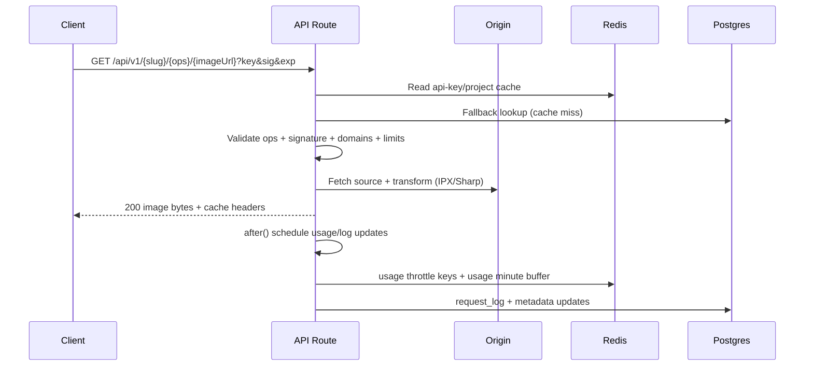
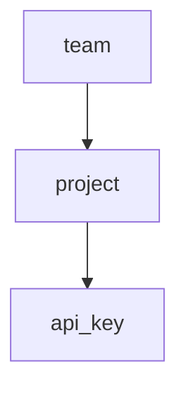

If you want a complete mental model of OptStuff, read this page first. It gives you the big picture and an efficient reading path across the Architecture section.

## Two-Plane Mental Model

OptStuff has two major planes:

1. **Control Plane (Dashboard + tRPC)**
   Teams, projects, API keys, domain settings, and onboarding workflows.
2. **Data Plane (Image API `/api/v1/...`)**
   Signed request validation, source fetch, image transform, rate limiting, logging, and usage tracking.

## Component Map

| Component | Responsibility | Main Files |
|-----------|----------------|------------|
| **Image API Gateway** | Handles `GET`/`HEAD` image requests and enforces all request checks | `src/app/api/v1/[projectSlug]/[...path]/route.ts` |
| **Validation Utilities** | Parses signature params, validates operations and domain rules | `src/server/lib/validators.ts`, `src/lib/ipx-utils.ts` |
| **Crypto & Key Handling** | API key generation, encryption/decryption, signature verification | `src/server/lib/api-key.ts` |
| **Config Cache** | Caches project/API-key configs (positive + negative cache) | `src/server/lib/config-cache.ts` |
| **Rate Limiter** | Per-day and per-minute sliding-window checks | `src/server/lib/rate-limiter.ts` |
| **Image Engine** | Fetch + transform using IPX/Sharp | `src/server/lib/ipx-factory.ts` |
| **Observability** | Request logging and activity/usage updates | `src/server/lib/request-logger.ts`, `src/server/lib/usage-tracker.ts` |
| **Control Plane (tRPC)** | Team/project/API-key management | `src/server/api/routers/*.ts` |
| **Auth & Route Guard** | Clerk auth + service-route bypass for `/api/v1` | `src/server/api/trpc.ts`, `src/proxy.ts` |

## Validation Pipeline

### Why This Order

- Signature verification happens before expensive project/rate-limit work on invalid traffic.
- Project is loaded by `apiKey.projectId` first, then slug is matched to prevent cross-project confusion.
- Rate limiting runs after signature verification so invalid requests cannot consume quota.

## Request Flows

### GET Flow

### HEAD Fast-Path Flow

- Reuses the same auth/abuse validation pipeline as `GET`.
- Performs a lightweight upstream `HEAD` probe (no image transform).
- Returns header-only responses with `X-Head-Fast-Path: 1`.

## Data Model & Tenancy

| Entity | Notes |
|--------|------|
| `team` | Ownership boundary (one personal team per user via onboarding) |
| `project` | Holds domain security settings and aggregate usage metadata |
| `api_key` | Public/secret pair, expiry, revocation, per-key rate-limit values |
| `usage_record` | Aggregated usage rows |
| `request_log` | Per-request operational telemetry (sanitized URL) |

## Security Model

| Layer | Mechanism | Notes |
|-------|-----------|------|
| URL Auth | HMAC-SHA256 signature | Constant-time compare, optional `exp` |
| Key Storage | AES-256-GCM + HKDF | Secret keys encrypted at rest |
| Source Control | `allowedSourceDomains` | Production empty-list is fail-closed |
| Hotlinking Control | `allowedRefererDomains` | Missing `Referer` is allowed by design |
| Abuse Control | Per-key rate limiting | Day window then minute window |

## Operations Reference (Server Validation)

| Operation | Example | Validation Rule |
|-----------|---------|-----------------|
| `w` | `w_800` | Integer `1..8192` |
| `h` | `h_600` | Integer `1..8192` |
| `q` | `q_80` | Integer `1..100` |
| `f` | `f_webp` | `webp\|avif\|png\|jpg` |
| `fit` | `fit_cover` | `cover\|contain\|fill` |
| `s` | `s_1200x630` | `{w}x{h}` with each `1..8192` |
| `embed` | `embed` | Flag only (no value) |

## Operational Notes

- **Cache propagation:** config cache TTL is 60s; negative cache TTL is 10s.
- **Rate-limiter availability:** Redis failures fail open (request allowed).
- **Request logging:** source URL is sanitized (query/hash removed); retention target is 30 days; errors are always logged while successful requests can be sampled via `REQUEST_LOG_SUCCESS_SAMPLE_RATE`.
- **Usage metering:** successful request counters are buffered in Redis minute buckets and flushed to `usage_record` via scheduled cron maintenance (with optional high-frequency flush route on higher plans).
- **Original-size metric:** sampled (10%) to avoid extra upstream `HEAD` on every success.
- **Metric formulas:** exact Usage metric formulas and caveats are documented in [Usage Metrics Calculations](/architecture/usage-metrics-calculations).
- **HEAD upstream behavior:** non-image content-type probes are treated as transform-ineligible (`502`).

## Recommended Reading Order

To understand how the system was built up end-to-end, follow this order:

1. [Control Plane and Multi-Tenancy](/architecture/control-plane-and-tenancy) — How teams/projects/API keys are modeled and managed.
2. [User Onboarding Flow](/architecture/user-onboarding-flow) — How a new user becomes an active project owner.
3. [Create API Key Flow](/architecture/create-api-key-flow) — Dual-key model, encryption-at-rest, and rotation.
4. [Request Lifecycle](/architecture/request-lifecycle) — Request-by-request runtime path for `GET` and `HEAD`.
5. [Usage Metering Pipeline](/architecture/usage-metering-pipeline) — Hot-path buffering, flush jobs, consistency model, and operational controls.
6. [Usage Metrics Calculations](/architecture/usage-metrics-calculations) — Exact formulas, data sources, and sampling caveats for analytics.
7. [Redis Schema](/architecture/redis-schema) — Cache-aside, rate-limit counters, write throttling, and usage buffer keys.
8. [SSRF Prevention](/architecture/ssrf-prevention) — Threat model and redirect-handling invariant.

## Related Docs

- [API Endpoint](/api-reference/endpoint)
- [Rate Limiting](/guides/rate-limiting)
- [URL Signing](/guides/url-signing)
- [Usage Metrics Calculations](/architecture/usage-metrics-calculations)
- [Usage Metering Pipeline](/architecture/usage-metering-pipeline)
- [Security Best Practices](/guides/security-best-practices)
