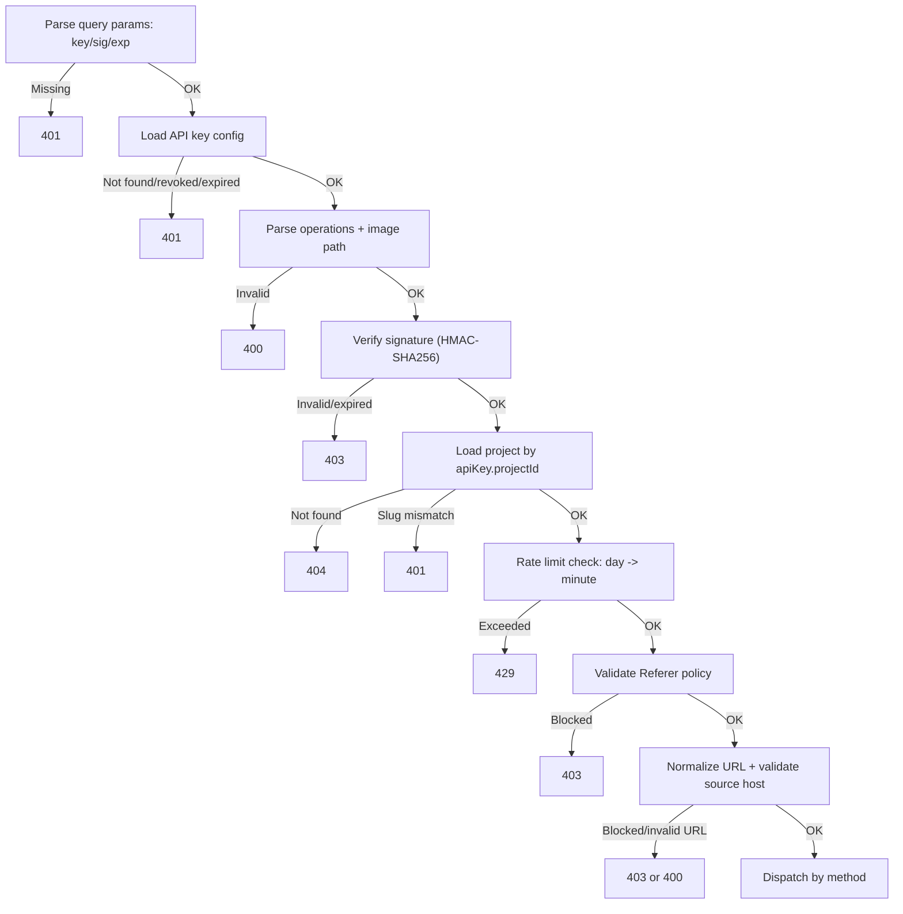
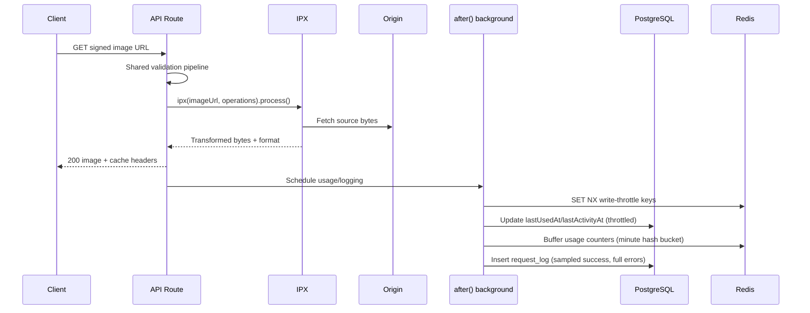
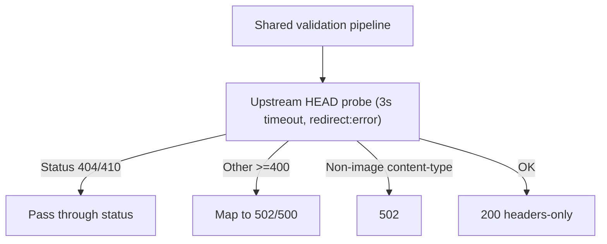

This page documents exactly what happens when a request hits the image API route:

`/api/v1/{projectSlug}/{operations}/{imageUrl}?key={publicKey}&sig={signature}&exp={optional}`

## Why this matters

Understanding this lifecycle lets you reason about:

- Security boundaries (which checks happen before network fetch)
- Cost behavior (when transforms or probes occur)
- Failure behavior (`401` vs `403` vs `429` vs `502/500`)
- Side effects (logging and usage updates)

## Shared Validation Pipeline (`GET` + `HEAD`)

Both methods run through the same validation pipeline before any upstream image fetch:

## `GET` Lifecycle (transform path)

### `GET` response headers

- `Cache-Control: public, s-maxage=31536000, max-age=31536000, immutable`
- `Vary: Accept` (or `Accept, Referer` when referer policy exists)
- `X-Head-Fast-Path: 0`
- `Server-Timing: auth, transform, total`

## `HEAD` Lifecycle (fast path)

`HEAD` skips image transform and performs an upstream `HEAD` probe after validation.

### `HEAD` response headers

- `X-Head-Fast-Path: 1`
- `Cache-Control` and `Vary` are still set
- `Server-Timing: auth, probe, total`

## Status Code Semantics

| Category | Typical status | Notes |
|---|---:|---|
| Missing credentials | `401` | Missing `key`/`sig`, invalid API key, revoked/expired key |
| Signature rejected | `403` | Invalid HMAC or expired `exp` signature payload |
| Bad request format | `400` | Invalid path/operations/image URL encoding |
| Abuse control | `429` | Per-key minute/day limit exceeded |
| Policy denied | `403` | Referer or source domain blocked |
| Upstream/runtime issues | `502` / `500` | Non-passthrough upstream failures, processing errors |

## Background Side Effects

After successful `GET` response:

1. **Usage tracking** (fire-and-forget):  
   throttled updates to `api_key.lastUsedAt` and `project.lastActivityAt`.
2. **Usage metering buffer** (fire-and-forget):  
   increment Redis minute-bucket counters for `(projectId, apiKeyId, requests, bytes)`.
3. **Request logging**:  
   sanitized source URL (query/hash stripped), operations string, status, error detail (for failures), and size/timing metadata.
4. **Optional original size sampling**:  
   ~10% requests perform an extra upstream `HEAD` for size analytics.

Buffered usage counters are later flushed to `usage_record` by cron maintenance (default: `/api/cron/daily-maintenance`; optional high-frequency flush route: `/api/cron/flush-usage-buffer`).

These side effects are intentionally non-blocking to keep tail latency low.

## Production Logging Strategy

OptStuff uses a tiered request logging policy to balance observability and runtime cost:

- **Error and policy-denied requests** (`error`, `forbidden`, `rate_limited`) are logged **100%**.
- **Successful requests** can be sampled via `REQUEST_LOG_SUCCESS_SAMPLE_RATE` (`0.0 ~ 1.0`).
- Default behavior:
  - `production`: `0.2` (20%)
  - `development` / `test`: `1.0` (100%)

### Design Rationale

At high traffic volume, writing one relational row per success request can become a significant DB write load in serverless environments. Sampling successful traffic while retaining all abnormal traffic preserves debugging signal (what failed, why, and where) and reduces write amplification on the hot path.

### Operational Trade-off

When success sampling is below `1.0`, request-log-derived dashboards (for example top images or aggregate bandwidth computed from `request_log`) become sampled telemetry, not strict accounting. For exact billing or quota math, use dedicated usage counters/aggregates instead of per-request logs.

## Related Docs

- [Architecture Overview](/architecture/overview)
- [Usage Metrics Calculations](/architecture/usage-metrics-calculations)
- [Redis Schema](/architecture/redis-schema)
- [API Endpoint](/api-reference/endpoint)
- [URL Signing](/guides/url-signing)
