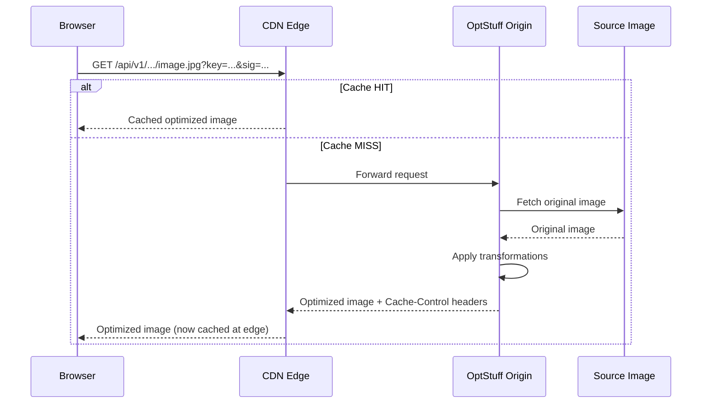

OptStuff returns long-lived cache headers optimized for CDN edge caching.

## How OptStuff Caching Works

Every successful response includes these headers:

```text
Cache-Control: public, s-maxage=31536000, max-age=31536000, immutable
Content-Type: image/webp
```

| Header | Meaning |
|--------|---------|
| `public` | CDNs and shared caches may store the response |
| `s-maxage=31536000` | CDN edge caches keep the response for 1 year |
| `max-age=31536000` | Browser caches keep the response for 1 year |
| `immutable` | Browser should not revalidate, even on reload |

### Why 1-Year Cache Is Safe

OptStuff URLs are **content-addressable**: the URL encodes all transformation parameters and a cryptographic signature. Changing any parameter (width, format, quality, image source) produces a different URL. This means:

- The same URL **always** produces the same output
- There is no risk of serving stale content
- A 1-year TTL is safe and optimal

Since URLs are content-addressable, traditional cache invalidation is unnecessary. To serve a different version of an image, generate a new URL with different parameters or a different `exp` timestamp — the new URL is a different cache entry.

For better cache hit rates, avoid generating a brand-new `exp` every render (`now + ttl` per request). Use time buckets (for example, hourly) so repeated requests within the same window reuse the same URL.

## CDN Architecture



On the first request, the CDN fetches from OptStuff, which fetches and optimizes the source image. Subsequent requests for the same URL are served directly from the CDN edge — no origin request needed.

## Cloudflare

Cloudflare automatically caches image responses based on `Cache-Control` headers.

### Setup

1. Point your domain's DNS to Cloudflare (proxy mode enabled)
2. Set your OptStuff deployment URL as the origin
3. No additional cache rules are needed — Cloudflare respects `Cache-Control` headers for image content types

### Recommended Settings

| Setting | Value | Why |
|---------|-------|-----|
| Cache Level | Standard | Respects `Cache-Control` headers |
| Browser Cache TTL | Respect Existing Headers | Preserves the `immutable` directive |
| Polish | Off | OptStuff already optimizes images; double-optimization wastes resources |
| Mirage | Off | Not needed — OptStuff handles responsive sizing |

### Cache Purge

To invalidate a specific image, use Cloudflare's **Purge by URL** feature in the dashboard or API:

```bash
curl -X POST "https://api.cloudflare.com/client/v4/zones/{zone_id}/purge_cache" \
  -H "Authorization: Bearer {api_token}" \
  -H "Content-Type: application/json" \
  --data '{"files":["https://images.example.com/api/v1/my-blog/w_800,f_webp/cdn.example.com/photo.jpg?key=pk_...&sig=..."]}'
```

## Vercel (Edge Network)

If your Next.js application is deployed on Vercel, Vercel's Edge Network caches OptStuff responses automatically.

### Setup

No additional configuration needed. Vercel's Edge Network respects `Cache-Control` headers and caches at edge locations globally.

### Using with `next/image`

You can use OptStuff as a custom image loader with `next/image` by pointing the
loader to an API Route that signs URLs server-side. This keeps the secret key on
the server while giving you full responsive `srcSet` support — without requiring
Vercel's built-in image optimization.

The loader below only builds the URL on the client. The actual URL signing (using the secret key) happens inside the `/api/optstuff` API Route on the server — the secret key is never exposed to the browser.

See the [Custom next/image Loader guide](/guides/nextjs-image-loader) for the
full implementation.

```tsx
"use client";

import Image, { type ImageLoaderProps } from "next/image";

function optstuffLoader({ src, width, quality }: ImageLoaderProps) {
  const params = new URLSearchParams({
    url: src,
    w: String(width),
    q: String(quality ?? 80),
    f: "webp",
  });
  return `/api/optstuff?${params}`;
}

export function Hero() {
  return (
    <Image
      loader={optstuffLoader}
      src="cdn.example.com/hero.jpg"
      alt="Hero"
      width={1200}
      height={630}
      sizes="(max-width: 768px) 100vw, 1200px"
    />
  );
}
```

## AWS CloudFront

### Setup

1. Create a CloudFront distribution with your OptStuff deployment as the origin
2. Set the **Origin Protocol Policy** to "HTTPS Only"
3. Under **Cache Behavior**, set **Cache Policy** to `CachingOptimized` (or a custom policy that respects `Cache-Control` headers)

### Recommended Cache Policy

| Setting | Value |
|---------|-------|
| Minimum TTL | 0 |
| Maximum TTL | 31536000 (1 year) |
| Default TTL | 86400 (1 day) |
| Headers | None (do not forward) |
| Query Strings | Forward all (required — `key`, `sig`, `exp` affect the response) |
| Cookies | None |

### Cache Invalidation

```bash
aws cloudfront create-invalidation \
  --distribution-id E1234567890 \
  --paths "/api/v1/my-blog/w_800,f_webp/cdn.example.com/photo.jpg*"
```

## Performance Tips

| Tip | Benefit |
|-----|---------|
| **Use a consistent URL format** | Maximizes cache hit ratio — avoid generating different URLs for the same image |
| **Bucket `exp` timestamps** | Reuse the same signed URL within fixed windows (hour/day) to improve CDN/browser hit ratio |
| **Set `exp` to long durations for static content** | 24 hours or more for images that don't change frequently |
| **Pre-warm popular images** | Request commonly used images ahead of time to populate the CDN cache |
| **Use `f_webp` or `f_avif`** | Modern formats are smaller, reducing bandwidth and improving cache efficiency |
| **Standardize widths** | Use a fixed set of breakpoints (e.g., 320, 640, 768, 1024, 1280, 1920) to reduce cache cardinality |

## Monitoring Cache Performance

Most CDNs add response headers indicating cache status:

| CDN | Header | HIT Value |
|-----|--------|-----------|
| Cloudflare | `cf-cache-status` | `HIT` |
| Vercel | `x-vercel-cache` | `HIT` |
| CloudFront | `x-cache` | `Hit from cloudfront` |

Check these headers to verify that images are being served from the edge:

```bash
curl -I "https://images.example.com/api/v1/my-blog/w_800,f_webp/cdn.example.com/photo.jpg?key=pk_...&sig=..."
```

## Related Documentation

- [API Endpoint](/api-reference/endpoint) — Response format and cache headers
- [Image Operations](/api-reference/image-operations) — Supported transformations
- [Integration Guide](/getting-started/integration-guide) — Adding OptStuff to your application ([Next.js](/getting-started/integration-guide/nextjs))
