OptStuff provides two layers of domain whitelisting, each serving a different purpose.

## Two-Layer Architecture

```mermaid
flowchart TD
  A["Incoming Request"] --> B{"Layer 1: Project\nallowedRefererDomains"}
  B -->|"Referer not allowed"| X1["403 Forbidden"]
  B -->|"Referer OK (or list empty)"| C{"Layer 2: API Key\nallowedSourceDomains"}
  C -->|"Source domain not allowed"| X2["403 Forbidden"]
  C -->|"Source domain OK"| D["Process Image"]
```



| Layer | Question | Validation |
|-------|----------|------------|
| **Project** (`allowedRefererDomains`) | WHO can use this service? | HTTP Referer header |
| **API Key** (`allowedSourceDomains`) | WHAT image sources can be processed? | Image URL in request |

**Why two layers?**

- **Separation of concerns** — Control who uses the service vs. what gets processed
- **Granular permissions** — Different API keys can have different source restrictions
- **Principle of least privilege** — Each key only allows what's necessary

## Configuring Referer Domains (Project Level)

1. Navigate to **Dashboard → Project → Settings**
2. In **Allowed Referer Domains**, add your website domains
3. Subdomain matching: adding `example.com` automatically allows `www.example.com`, `cdn.example.com`, etc.

| List Status | Behavior |
|-------------|----------|
| Empty (default) | All referers allowed |
| Non-empty | Only listed domains allowed |

> **Note:** When the list is non-empty, only requests with a `Referer` header that matches a listed domain are allowed. Requests **without** a `Referer` header (e.g., server-to-server calls, privacy-stripping browser policies) are always allowed — the signed URL already authenticates the request, and an absent referer does not indicate hotlinking. See [Understanding Referer-Based Protection](/guides/referer-security-model) for why.

## Configuring Source Domains (API Key Level)

1. Navigate to **Dashboard → Project → API Keys**
2. Click the API key to edit
3. In **Allowed Source Domains**, add image origin domains
4. Subdomain matching: `example.com` also matches `cdn.example.com`

| Environment | Behavior When List Is Empty |
|-------------|---------------------------|
| Production | **Reject all** requests (fail closed) |
| Development | Allow all sources (for convenience) |

> **Important:** Always configure at least one source domain for production API keys.

## Practical Example

```text
Project: my-company
allowedRefererDomains: [site-a.com, site-b.com]

API Key 1 (for site-a.com):
  allowedSourceDomains: [cdn.site-a.com]

API Key 2 (for site-b.com):
  allowedSourceDomains: [images.site-b.com, s3.amazonaws.com]

API Key 3 (shared across sites):
  allowedSourceDomains: [cdn.site-a.com, images.site-b.com]
```

## Related Documentation

- [Core Concepts](/introduction/core-concepts) — Overview of the resource hierarchy
- [Security Best Practices](/guides/security-best-practices) — Broader security recommendations
- [Error Codes](/api-reference/error-codes) — `403` errors for domain violations
