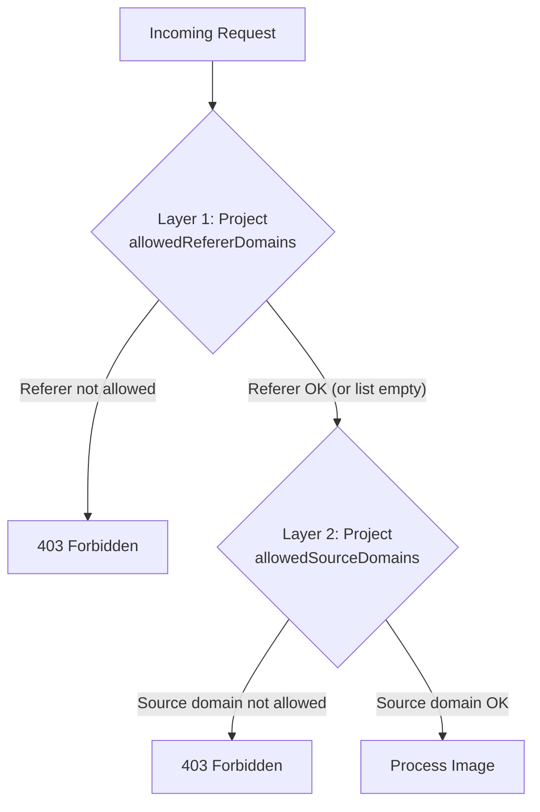

OptStuff provides two layers of domain whitelisting at the project level, each serving a different purpose.

## Two-Layer Architecture



| Layer | Question | Validation | Configured In |
|-------|----------|------------|---------------|
| **Authorized Websites** (`allowedRefererDomains`) | WHO can use this service? | HTTP Referer header | Project Settings |
| **Image Sources** (`allowedSourceDomains`) | WHAT image sources can be processed? | Image URL in request | Project Settings |

Both layers are configured in the project's **Settings** tab under **Domain Security**.

## Configuring Image Sources (Project Level)

1. Navigate to **Dashboard → Project → Settings**
2. In **Image Sources**, add the domains where your images are hosted
3. Subdomain matching: adding `example.com` automatically allows `cdn.example.com`, `images.example.com`, etc.

| List Status | Production Behavior | Development Behavior |
|-------------|--------------------|--------------------|
| Empty (default) | **Reject all** requests (fail closed) | Allow all sources (for convenience) |
| Non-empty | Only listed domains allowed | Only listed domains allowed |

> **Important:** Always configure at least one image source domain before using OptStuff in production.

## Configuring Authorized Websites (Project Level)

1. Navigate to **Dashboard → Project → Settings**
2. In **Authorized Websites**, add your website domains
3. Subdomain matching: adding `example.com` automatically allows `www.example.com`, `cdn.example.com`, etc.

| List Status | Behavior |
|-------------|----------|
| Empty (default) | All referers allowed |
| Non-empty | Only listed domains allowed |

> **Note:** When the list is non-empty, only requests with a `Referer` header that matches a listed domain are allowed. Requests **without** a `Referer` header (e.g., server-to-server calls, privacy-stripping browser policies) are always allowed — the signed URL already authenticates the request, and an absent referer does not indicate hotlinking. See [Understanding Referer-Based Protection](/guides/referer-security-model) for why.

## Practical Example

```text
Project: my-company
  allowedSourceDomains: [cdn.site-a.com, images.site-b.com, s3.amazonaws.com]
  allowedRefererDomains: [site-a.com, site-b.com]
```

All API keys in this project share the same domain restrictions. Different keys are used for credential rotation and access control — not for domain segmentation.

## Related Documentation

- [Core Concepts](/introduction/core-concepts) — Overview of the resource hierarchy
- [Security Best Practices](/guides/security-best-practices) — Broader security recommendations
- [Error Codes](/api-reference/error-codes) — `403` errors for domain violations
