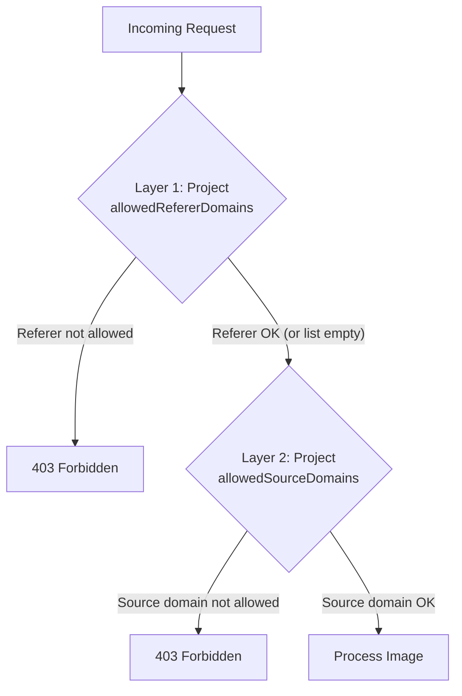

OptStuff provides two layers of domain whitelisting at the project level, each serving a different purpose.

## Two-Layer Architecture


```mermaid
flowchart TD
  A["Incoming Request"] --> B{"Layer 1: Project\nallowedRefererDomains"}
  B -->|"Referer not allowed"| X1["403 Forbidden"]
  B -->|"Referer OK (or list empty)"| C{"Layer 2: Project\nallowedSourceDomains"}
  C -->|"Source domain not allowed"| X2["403 Forbidden"]
  C -->|"Source domain OK"| D["Process Image"]
```

| Layer | Question | Validation | Configured In |
|-------|----------|------------|---------------|
| **Authorized Websites** (`allowedRefererDomains`) | WHO can use this service? | HTTP Referer header | Project Settings |
| **Image Sources** (`allowedSourceDomains`) | WHAT image sources can be processed? | Image URL in request | Project Settings |

Both layers are configured in the project's **Settings** tab under **Domain Security**.

## Configuring Image Sources (Project Level)

1. Navigate to **Dashboard → Project → Settings**
2. In **Image Sources**, add the domains where your images are hosted
3. Use protocol-prefixed entries (for example `https://images.example.com`)
4. Subdomain matching: adding `https://example.com` allows `example.com` and all subdomains (`cdn.example.com`, `img.example.com`, ...)

| List Status | Production Behavior | Development Behavior |
|-------------|--------------------|--------------------|
| Empty (default) | **Reject all** requests (fail closed) | Allow all sources (for convenience) |
| Non-empty | Only listed domains allowed | Only listed domains allowed |

> **Important:** Always configure at least one image source domain before using OptStuff in production. In production, an empty source list rejects all requests.

## Configuring Authorized Websites (Project Level)

1. Navigate to **Dashboard → Project → Settings**
2. In **Authorized Websites**, add your website domains
3. Use protocol-prefixed entries (for example `https://app.example.com`)
4. Subdomains are **not** implied for exact host entries; use wildcard when needed:
   - `https://app.example.com` → only this host
   - `https://*.example.com` → all subdomains (and `example.com`)

| List Status | Behavior |
|-------------|----------|
| Empty (default) | All referers allowed |
| Non-empty | Only listed domains allowed |

> **Note:** When the list is non-empty, only requests with a `Referer` header that matches a listed domain are allowed. Requests **without** a `Referer` header (e.g., server-to-server calls, privacy-stripping browser policies) are always allowed — the signed URL already authenticates the request, and an absent referer does not indicate hotlinking. See [Referer Security Model](/guides/referer-security-model) for why.

## Wildcard Syntax

Wildcard entries use the `*` prefix to match all subdomains:

| Entry | Matches | Does NOT Match |
|-------|---------|----------------|
| `https://example.com` | `example.com` and all subdomains | — |
| `https://*.example.com` | `cdn.example.com`, `img.example.com`, `example.com` | `other-site.com` |
| `https://cdn.example.com` | `cdn.example.com` only | `img.example.com` |

<Callout type="info">
For **Image Sources**, adding `https://example.com` automatically includes all subdomains. For **Authorized Websites**, use `https://*.example.com` explicitly when you need subdomain matching.
</Callout>

## Practical Example

```text
Project: my-company
  allowedSourceDomains: [https://cdn.site-a.com, https://images.site-b.com, https://s3.amazonaws.com]
  allowedRefererDomains: [https://app.site-a.com, https://*.site-b.com]
```

All API keys in this project share the same domain restrictions. Different keys are used for credential rotation and access control — not for domain segmentation.

## Environment-Specific Configuration

| Environment | Image Sources | Authorized Websites |
|-------------|--------------|-------------------|
| **Development** | Empty list (allows all sources for convenience) | Empty list (allows all) |
| **Staging** | Same as production | Add your staging domain (`https://staging.example.com`) |
| **Production** | Explicitly list all allowed origins | Explicitly list all allowed websites |

<Callout type="warn">
In production, an empty `allowedSourceDomains` list rejects **all** requests (fail-closed). Always add at least one domain before going live.
</Callout>

## Troubleshooting

| Error | Common Cause | Solution |
|-------|-------------|----------|
| `403` Source domain not allowed | Image origin not in project's allowed sources | Add the domain (with `https://` prefix) in Dashboard → Settings → Domain Security → Image Sources |
| `403` Invalid referer | Your website not in allowed referer list | Add your domain in Dashboard → Settings → Domain Security → Authorized Websites |
| `403` on images that previously worked | Domain settings changed or cache propagation delay | Wait ~60s for settings to propagate; verify domains are still listed |
| Images work in development but not production | Empty source list allows all in dev, rejects all in prod | Add explicit domains for production |

### Common Mistakes

- **Missing protocol** — Entries must include `https://` (e.g., `https://cdn.example.com`, not `cdn.example.com`)
- **Trailing slashes** — Do not include trailing slashes (use `https://cdn.example.com`, not `https://cdn.example.com/`)
- **Port numbers** — Include the port if your origin uses a non-standard port (e.g., `http://localhost:3000`)

## Related Documentation

- [Core Concepts](/introduction/core-concepts) — Overview of the resource hierarchy
- [Referer Security Model](/guides/referer-security-model) — Trust model for Referer-based protection
- [Security Best Practices](/guides/security-best-practices) — Broader security recommendations
- [Error Codes](/api-reference/error-codes) — `403` errors for domain violations
