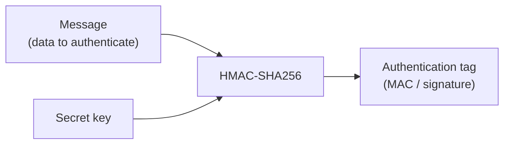
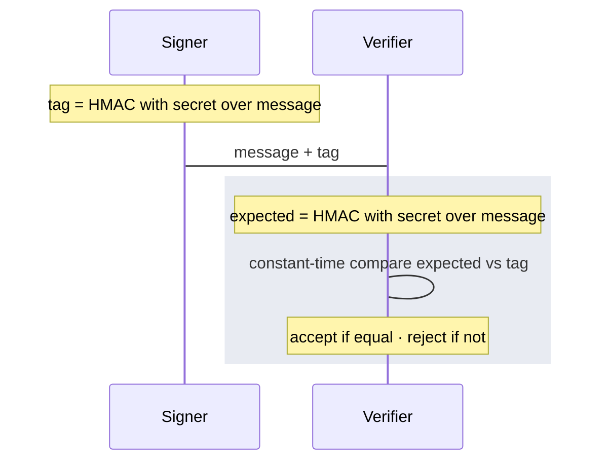

OptStuff uses **HMAC-SHA256** to prove that a URL was created by someone who holds your **secret key**. This page is a **concept primer**: what HMAC is, what security properties it gives you, and how that relates to the `sig` value in a signed URL.

If you want the exact payload format, encoding rules, `exp` behavior, and implementation steps, see [URL Signing](/guides/url-signing). For ready-to-use code, see [Code Examples](/guides/code-examples).

## Message authentication in one sentence

**HMAC lets a server attach a secret-based proof to a message, so another server with the same secret can verify that the message was approved by a trusted signer and has not been changed.**

Put more simply:

- the **message** is the data being protected
- the **secret key** is known only to trusted systems
- the **signature** is the proof produced from the message and the secret
- if the message changes, the signature no longer matches

That is the core idea behind HMAC-based message authentication.

Start with **how the authentication tag is computed**. Signer and verifier both use the same operation: feed the **message** and **secret key** into HMAC; the output is the **tag** (also called the MAC or signature).

**Reading the block diagram:**

- **Message:** The exact bytes or string both sides feed into HMAC. Signer and verifier must use the same content in the same order and encoding; if anything changes, the tag will not match.
- **Secret key:** A shared secret known only to parties that are allowed to sign or verify.
- **Authentication tag:** The fixed-length output of HMAC. It acts as proof that someone with the key approved this message and that the message was not tampered with afterward.

The tag does **not** embed or encode the message itself: HMAC output length is fixed no matter how long the message is, and you cannot recover the message from the tag alone. What the tag provides is a **binding** under the secret: any change to the message changes the tag. Protocols therefore pass **message and tag together** (or the verifier rebuilds the same message from context and compares against the tag).

**Then**, in a typical integration, one party **signs** by running that computation once and sends the **message plus tag** to another party that **verifies** by running the same HMAC again and comparing:

For OptStuff signed URLs, which fields make up the message and how the tag is represented in the URL are defined in [URL Signing](/guides/url-signing).

## Why not just use a plain hash?

A plain cryptographic hash, such as SHA-256 of the message alone, is not enough.

Why:

- A hash uses no secret
- Anyone can hash the same message themselves
- That means a matching hash does not prove a trusted party approved that message

For example, if an attacker can guess or construct possible messages, they can compute hashes for them on their own. A plain hash only says “this data hashes to this value.” It does not say “a trusted signer approved this data.”

HMAC fixes that by adding a secret key to the process: only someone with the secret can produce a valid tag for a chosen message, and any change to the message breaks the tag.

## HMAC is not encryption

It is important to separate these ideas:

- Encryption is for hiding data
- HMAC is for proving authenticity and integrity

HMAC does not hide the message: whatever you put in stays visible to anyone who sees it. The tag only proves integrity and authenticity.

So an observer can read the message. What they cannot practically do is recover your secret key from the message and tag, or forge valid tags for new messages without the secret.

## What security property do you get?

Using HMAC gives you two main guarantees:

1. **Authenticity:** The message was approved by someone who knows the secret key.
2. **Integrity:** The message has not been changed since it was signed.

There is still **no confidentiality** (see [HMAC is not encryption](#hmac-is-not-encryption) above). For capability-style URLs (including OptStuff), possession of the full URL may be enough to use it until it expires or the key is rotated.

## What OptStuff does with HMAC

OptStuff applies the same pattern: public parts of the URL (such as `key`, operations, source URL, and optional `exp`) stay visible; `sig` is the authentication tag proving a holder of the secret key approved that exact combination.

OptStuff uses HMAC-SHA256 with your secret key over a defined signing payload derived from the request. That payload includes the values the product chooses to protect, such as:

- project or key identity
- operations
- source URL
- optional expiry
- other fields included by the signing spec

On each request, OptStuff recomputes the expected HMAC from the same payload and accepts the URL only when it matches `sig`; otherwise the request is rejected.

This page explains the concept only. For details such as base64url encoding, truncation to 32 characters, and exact payload construction, see URL Signing.

## Properties that matter for integrators

| Topic | What to remember |
| --- | --- |
| Secret custody | Keep `sk_...` on your server only. Never expose it to browsers, mobile apps, or client-side code. If it leaks, an attacker can mint valid URLs until you rotate the key. See [Key Management](/guides/key-management). |
| Replay | A valid signed URL can usually be reused as-is for the same request. Optional `exp` limits how long that is possible. See [URL Signing](/guides/url-signing) § Signature expiration. |
| Verification | Signature checks should use constant-time comparison to reduce timing side channels. OptStuff does this on its side; follow the same practice in your own security-sensitive code. See [Security Best Practices](/guides/security-best-practices). |
| Algorithm | The product standard is HMAC-SHA256. Do not replace it with plain hashes or custom signing schemes. |

## A simple mental model

Treat **`sig` as a tamper-evident seal** pressed with a stamp only trusted systems hold: the signed URL is the sealed package. Change the payload and the seal no longer fits; without the stamp, nobody can forge a valid seal for a new package.

## Related reading

- [Core Concepts](/introduction/core-concepts): how `sig` fits the signed-URL contract
- [Referer Security Model](/guides/referer-security-model): why Referer is not a replacement for signing
- [URL Signing](/guides/url-signing): authoritative signing specification for OptStuff
