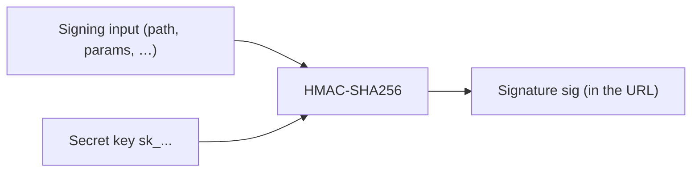

OptStuff uses **HMAC-SHA256** to prove that a URL was created by someone who holds your **secret key**. This page is a **concept primer**: what HMAC is, what security properties it gives you, and how that relates to the `sig` value in a signed URL.

If you want the exact payload format, encoding rules, `exp` behavior, and implementation steps, see [URL Signing](/guides/url-signing). For ready-to-use code, see [Code Examples](/guides/code-examples).

## Message authentication in one sentence

**HMAC lets a server attach a secret-based proof to a message, so another server with the same secret can verify that the message was approved by a trusted signer and has not been changed.**

Put more simply:

- the **message** is the data being protected
- the **secret key** is known only to trusted systems
- the **signature** is the proof produced from the message and the secret
- if the message changes, the signature no longer matches

That is the core idea behind OptStuff signed URLs.

In this diagram:

- Signing input means the exact canonical string defined by the product

- Secret key means your private sk_...

- Signature means the sig value added to the URL

In OptStuff, the signing input is not just “whatever the incoming HTTP path happens to be.” It is the specific string the signing spec tells you to build. That usually includes URL path parts plus selected query parameters such as exp. If any included value changes, the signature becomes invalid unless the URL is signed again.

That exact recipe is defined as the payload in URL Signing.

## Why not just use a plain hash?
A plain cryptographic hash, such as SHA-256 of the path, is not enough.

Why:

- A hash uses no secret

- Anyone can hash the same input themselves

- That means a matching hash does not prove your server approved the URL

For example, if an attacker can guess or construct possible inputs, they can compute hashes for them on their own. A plain hash only says “this data hashes to this value.” It does not say “a trusted signer approved this data.”

HMAC fixes that by adding a secret key to the process.

With HMAC:

- a valid signature can be created only by someone who knows sk_...

- anyone without the secret cannot forge signatures for new inputs they choose

- changing the signed data breaks the signature

So in OptStuff, public parts of the URL may be visible, such as:

- key

- operations

- source URL

- exp

But sig is the proof that a holder of the secret key approved that exact combination.

## HMAC is not encryption
It is important to separate these ideas:

- Encryption is for hiding data

- HMAC is for proving authenticity and integrity

HMAC does not hide the message. The signed data is still visible in the URL path and query string. The sig value is only a verifier.

So if someone sees a signed URL, they can usually read its contents. What they cannot practically do is recover your secret key from the message and signature, or generate valid signatures for new messages without the secret.

## What security property do you get?

Using HMAC gives you two main guarantees:

1. 
Authenticity

The URL was signed by someone who knows the secret key.

2. 
Integrity

The signed parts of the URL have not been changed since signing.

This does not give you confidentiality. Anyone with the full signed URL can still use it until it expires or the key is rotated.

That is why signed URLs should be treated like capabilities: possession of the URL may be enough to use it.

## What OptStuff does with HMAC

OptStuff uses HMAC-SHA256 with your secret key over a defined signing payload derived from the request. That payload includes the values the product chooses to protect, such as:

- project or key identity

- operations

- source URL

- optional expiry

- other fields included by the signing spec

When a request arrives, OptStuff recomputes the expected HMAC from the same payload and compares it with the provided sig.

If the values match, the URL is accepted.

If they do not match, the request is rejected.

This page explains the concept only. For details such as base64url encoding, truncation to 32 characters, and exact payload construction, see URL Signing.

## Properties that matter for integrators

| Topic|What to remember|
|---|---|
Secret custody|Keep sk_... on your server only. Never expose it to browsers, mobile apps, or client-side code. If it leaks, an attacker can mint valid URLs until you rotate the key. See Key Management.|
Replay|A valid signed URL can usually be reused as-is for the same request. Optional exp limits how long that is possible. See URL Signing § Signature expiration.|
Verification|Signature checks should use constant-time comparison to reduce timing side channels. OptStuff does this on its side; follow the same practice in your own security-sensitive code. See Security Best Practices.|
Algorithm|The product standard is HMAC-SHA256. Do not replace it with plain hashes or custom signing schemes.|

## A simple mental model
You can think of HMAC like a tamper-evident seal created with a secret stamp.

- the URL is the package

- the secret key is the stamp only trusted systems own

- the signature is the seal on the package

If the package is changed, the seal no longer matches.

If someone does not have the stamp, they cannot make a valid seal for a new package.

That is essentially what sig does for an OptStuff URL.

## Related reading

- [Core Concepts](/introduction/core-concepts) — How sig fits the signed-URL contract

- [Referer Security Model](/guides/referer-security-model) — Why Referer is not a replacement for signing

- [URL Signing](/guides/url-signing) — Authoritative signing specification for OptStuff

