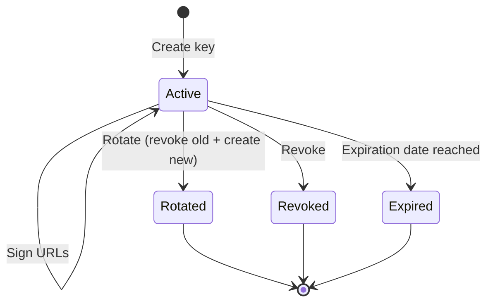

Every OptStuff API key goes through a lifecycle: creation, active use, and eventual rotation or revocation. Managing this lifecycle well is critical for keeping your integration secure.

## API Key Structure

Each API key consists of a **dual-key pair**:

| Component | Format | Purpose | Visibility |
|-----------|--------|---------|------------|
| Public Key | `pk_` + 22 characters (25 total) | Identifies requests in URLs | Viewable anytime in dashboard |
| Secret Key | `sk_` + base64url | Signs URLs (HMAC-SHA256) | **Shown only once** at creation/rotation |

For details on how keys are used in requests, see [URL Signing](/guides/url-signing).

## Key Lifecycle

### Creation

1. Create a key from the dashboard (see [Dashboard Setup](/getting-started/dashboard-setup))
2. Configure: name, allowed source domains, optional expiration
3. **Copy the secret key immediately** — it cannot be retrieved later

The public key can always be viewed and copied from the API key list.

### Rotation

Rotation **revokes the old key** and **creates a new one** in a single database transaction. The new key inherits all settings from the old key.

Use rotation when:

- A key may have been compromised
- Your regular rotation schedule triggers (recommended: every 90 days)

After rotation:

1. Copy the new secret key
2. Update your environment variables
3. Deploy the change

### Revocation

Revocation immediately disables a key. All subsequent requests using it will receive `401`.

Use revocation when:

- A key is confirmed compromised and you don't need a replacement
- A key is no longer needed
- You want to disable access for a specific integration

### Expiration

Set an optional expiration date when creating a key. After this date, the key is automatically rejected. This limits the damage window if a key is compromised and goes undetected.

## Best Practices

| Practice | Why |
|----------|-----|
| **Set expiration dates** | Limits damage window if a key is compromised |
| **Rotate every 90 days** | Reduces long-term exposure risk |
| **Use separate keys per environment** | Isolates production from development/staging |
| **Restrict source domains** | Principle of least privilege — each key only allows necessary domains |
| **Revoke compromised keys immediately** | Stops unauthorized access instantly |
| **Sign URLs server-side only** | Secret key never exposed to browsers |
| **Store secret keys in environment variables** | Never hard-code or commit to version control |

## Environment Strategy

| Environment | Recommended Setup |
|-------------|-------------------|
| Development | Separate key with relaxed source domains, short expiration |
| Staging | Separate key matching production domain restrictions |
| Production | Restricted source domains, rate limits tuned for expected traffic |

## Related Documentation

- [Dashboard Setup](/getting-started/dashboard-setup) — How to create and manage keys in the UI
- [URL Signing](/guides/url-signing) — How keys are used to sign requests
- [Security Best Practices](/guides/security-best-practices) — Broader security context
