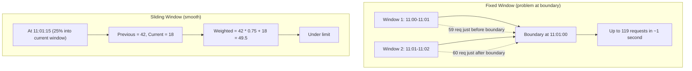

Rate limiting protects your account from abuse and unexpected costs. Each API key has independent rate limits, enforced globally across all server instances.

## Dual-Layer Limits

Every request is checked against two independent limits. Both must pass.

| Layer | Default | Window | Purpose |
|-------|---------|--------|---------|
| Per-day | 10,000 requests | 24 hours | Catch sustained overuse |
| Per-minute | 60 requests | 1 minute | Catch sudden bursts |

## Algorithm: Sliding Window

Unlike fixed windows that can allow up to 2× burst at boundaries, the sliding window algorithm produces smooth limits:



## Configuration

Rate limits are stored per API key in the database:

| Setting | Range | Default |
|---------|-------|---------|
| `rateLimitPerMinute` | 1 – 10,000 | 60 |
| `rateLimitPerDay` | 1 – 1,000,000 | 10,000 |

New API keys are created with the default limits. Custom per-key rate limits are not yet configurable through the dashboard UI — this feature is planned for a future release. If you need to adjust limits, update the `api_key` table directly:

- **`rateLimitPerMinute`** — valid range: 1 – 10,000
- **`rateLimitPerDay`** — valid range: 1 – 1,000,000

> **Before modifying:** back up the `api_key` table and validate that your values fall within the ranges above (the schema enforces integer type but not range — out-of-range values may cause unexpected behaviour). If you are unsure about the correct limits for your use case, contact support.

Changes take effect within 60 seconds (cache TTL).

## Response When Rate Limited

```json
{
  "error": "Rate limit exceeded",
  "reason": "Too many requests per minute",
  "retryAfter": 12,
  "limit": 60
}
```

`retryAfter` is the number of **seconds** to wait before retrying (consistent with the HTTP `Retry-After` header).

HTTP headers:

```text
HTTP/1.1 429 Too Many Requests
Retry-After: 12
X-RateLimit-Limit: 60
X-RateLimit-Remaining: 0
```

Clients should respect the `Retry-After` header to avoid further 429 responses.

## Tuning Recommendations

| Traffic Level | Recommendation |
|---------------|----------------|
| Low (< 100 req/day) | Defaults work well |
| Medium (100 – 10,000 req/day) | Monitor analytics; increase per-day limit if hit legitimately |
| High (> 10,000 req/day) | Set per-key limits based on expected traffic to avoid false 429s |

## Client-Side Retry Strategy

When receiving a `429` response, implement exponential backoff with jitter:

```typescript
async function fetchWithRetry(
  url: string,
  maxRetries: number = 3
): Promise<Response> {
  for (let attempt = 0; attempt <= maxRetries; attempt++) {
    const response = await fetch(url);

    if (response.status !== 429) return response;

    if (attempt === maxRetries) return response;

    const retryAfter = response.headers.get("Retry-After");
    const baseDelay = retryAfter
      ? Number(retryAfter) * 1000
      : Math.pow(2, attempt) * 1000;
    const jitter = Math.random() * 1000;
    await new Promise((resolve) => setTimeout(resolve, baseDelay + jitter));
  }

  throw new Error("Unreachable");
}
```

Key principles:

- **Respect `Retry-After`** — always prefer the server-provided delay over your own backoff
- **Add jitter** — prevents multiple clients from retrying in sync (thundering herd)
- **Limit retries** — 3 retries is usually sufficient; more indicates a capacity problem

## CDN and Rate Limiting Interaction

If you place a CDN (Cloudflare, CloudFront, Vercel Edge) in front of OptStuff:

| Scenario | Rate Limit Impact |
|----------|------------------|
| CDN cache **hit** | No request reaches OptStuff — rate limit is **not consumed** |
| CDN cache **miss** | Request reaches OptStuff — rate limit is consumed |
| First request for a URL | Always consumes quota (cache is cold) |

This means rate limits primarily affect unique or uncached requests. For high-traffic sites with good CDN cache hit ratios, rate limits are rarely a concern.

See [CDN and Caching](/guides/cdn-caching) for cache optimization strategies.

## Monitoring Recommendations

| What to Monitor | Why | Suggested Alert |
|----------------|-----|----------------|
| `429` response rate | Detect legitimate traffic hitting limits | Alert when `429` rate exceeds 5% of total requests |
| Per-key daily usage | Catch keys approaching limits | Alert at 80% of daily quota |
| Redis connectivity | Rate limiter depends on Redis | Alert on Redis connection errors |

When the rate limiter fails open (Redis unavailable), monitor for abnormal traffic patterns and consider temporary upstream WAF rules until Redis recovers.

## Design Notes

- Rate limits are checked **after** signature verification so that unauthenticated requests cannot exhaust quota.
- The per-day limit is checked **before** the per-minute limit to minimize token waste (see [Redis Schema](/architecture/redis-schema) for details).
- Both `GET` and `HEAD` requests consume quota because both run through the same authentication and abuse-protection pipeline.
- If Redis is temporarily unavailable, the limiter fails open (`allowed`) to prioritize image-serving availability; monitor infrastructure health accordingly.

## Related Documentation

- [Key Management](/guides/key-management) — Managing API keys (per-key rate limits not configurable in dashboard yet)
- [CDN and Caching](/guides/cdn-caching) — Cache strategies that reduce rate limit pressure
- [Error Codes](/api-reference/error-codes) — Rate limit error details
- [Security Best Practices](/guides/security-best-practices) — Broader security context
