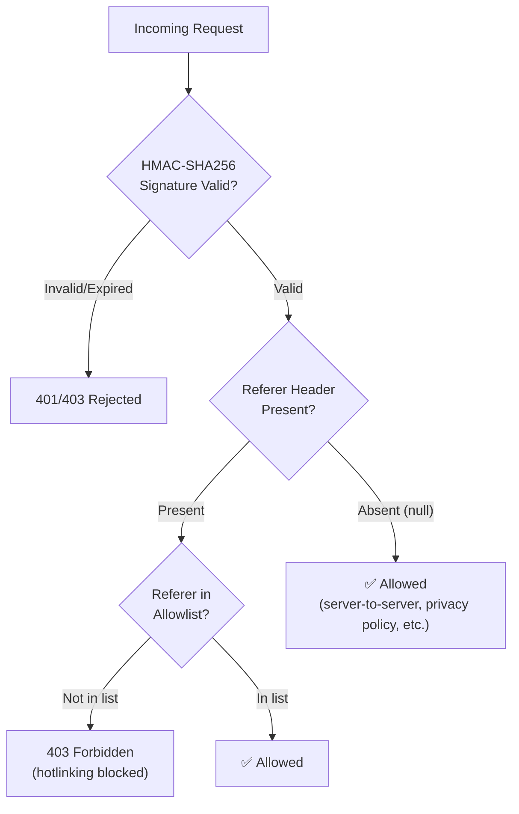

When protecting image assets from unauthorized embedding, the HTTP `Referer` header is a surprisingly effective tool — if you understand its trust boundaries. This article explains when and why `Referer` is trustworthy, and how OptStuff leverages it as a supplementary anti-hotlinking layer.

## What is the Referer header?

When a browser loads a resource (image, script, stylesheet, etc.), it typically includes a `Referer` header in the HTTP request that tells the server which page triggered the load.

```text
GET /api/v1/my-blog/w_800,f_webp/cdn.example.com/photo.jpg HTTP/1.1
Host: optstuff.example.com
Referer: https://my-blog.com/posts/hello-world
```

The header is set automatically by the browser. JavaScript on the page **cannot override it** — this is a fundamental browser security guarantee.

## Why is Referer trustworthy in browsers?

### The browser enforces it — JavaScript cannot

The [Fetch specification](https://fetch.spec.whatwg.org/#http-network-or-cache-fetch) defines `Referer` as a **forbidden header name**. This means:

- `fetch()` and `XMLHttpRequest` silently ignore any attempt to set it manually.
- The browser **always** fills it in based on the actual page origin.

```javascript
// This does NOT work — the browser ignores the custom Referer
fetch("https://optstuff.example.com/api/v1/...", {
  headers: { Referer: "https://evil.com" }, // silently dropped
});
```

A page on `https://evil.com` cannot forge a request that claims to come from `https://my-blog.com`. The browser guarantees the `Referer` reflects the real origin.

### Browser extensions can — but that's fine

A browser extension or modified browser _can_ alter the header. However, this requires explicit user action (installing an extension), which puts it in the same category as "the user can right-click → Save Image As." You're protecting against unauthorized _websites_, not against determined individual users.

### The Fetch spec's referrer policy

Sites can _restrict_ how much `Referer` information they send via the [`Referrer-Policy`](https://developer.mozilla.org/en-US/docs/Web/HTTP/Reference/Headers/Referrer-Policy) header. The available policies range from sending the full URL to sending nothing at all:

| Policy | Referer sent | Example |
|--------|-------------|---------|
| `no-referrer` | Never | _(empty)_ |
| `origin` | Origin only | `https://my-blog.com/` |
| `origin-when-cross-origin` | Origin for cross-origin | `https://my-blog.com/` |
| `strict-origin-when-cross-origin` (default) | Origin for cross-origin, full for same-origin | `https://my-blog.com/` |
| `unsafe-url` | Full URL always | `https://my-blog.com/posts/hello-world` |

The default browser policy (`strict-origin-when-cross-origin`) sends the **origin** on cross-origin requests, which is exactly the information OptStuff needs for domain validation.

A site _can_ choose `no-referrer`, which makes the header absent. But a site cannot make the header claim a _different_ origin. This is the key distinction: **a site can hide its identity, but it cannot impersonate another site.**

## When is Referer absent?

The `Referer` header is `null` in several legitimate scenarios:

| Scenario | Why | Example |
|----------|-----|---------|
| Server-to-server calls | No browser involved | SSR, cron jobs, webhooks |
| `Referrer-Policy: no-referrer` | Site opted out | Privacy-focused sites |
| Direct navigation | No referring page | User typed URL or used bookmark |
| HTTPS → HTTP downgrade | Browser strips it for security | _(rare in modern web)_ |
| Privacy tools | User or extension strips it | Ad blockers, privacy extensions |

These are all legitimate, non-malicious scenarios. Blocking them would create false positives without improving security — the signed URL already authenticates the request.

## OptStuff's layered security model

OptStuff uses defense-in-depth with distinct layers, each protecting against a specific threat:



| Layer | Purpose | Protects against |
|-------|---------|-----------------|
| **Signed URLs** (HMAC-SHA256) | **Authentication** — proves the request was authorized by someone with the secret key | Unauthorized access, URL forgery |
| **Referer validation** | **Anti-hotlinking** — prevents authorized URLs from being embedded on unauthorized websites | Browser-based hotlinking |

### Why this separation matters

**Signed URLs are the real authentication.** They cryptographically prove that someone with the secret key authorized this specific image request. This is the primary security gate.

**Referer validation is supplementary.** It solves a narrower problem: even with a valid signed URL, you may want to prevent it from being embedded on websites you don't control. Referer is the right tool for this because:

1. It works against the actual threat (unauthorized websites embedding your images)
2. The browser enforces it — the unauthorized site cannot bypass it
3. It doesn't interfere with legitimate server-side usage

### Absent Referer = allowed

When the `Referer` header is absent, OptStuff allows the request (assuming the signature is valid). This is the correct behavior because:

- **The signed URL already authenticates the request.** If someone has a valid signed URL, they were authorized to use it.
- **Null Referer doesn't indicate hotlinking.** It indicates a non-browser context (server-side rendering, API calls) or a privacy-stripping browser policy — none of which are the threat Referer validation targets.
- **Blocking null Referer creates false positives.** It breaks SSR blur placeholders, cron-based pre-warming, health checks, and users with strict privacy settings — all without preventing any real attack.

An attacker who strips their own `Referer` to bypass the check could just as easily download the image with `curl` and self-host it. The Referer check isn't meant to stop that — it stops the much more common scenario of someone copy-pasting your `` tag onto their website, where the browser _will_ send the real `Referer`.

## Summary

| Question | Answer |
|----------|--------|
| Can a website forge the `Referer` header? | **No.** Browsers forbid JS from overriding it. |
| Can a website hide the `Referer` header? | **Yes**, via `Referrer-Policy: no-referrer`. |
| Should absent `Referer` be blocked? | **No.** It indicates a non-browser or privacy-enhanced context, not hotlinking. |
| Is `Referer` a good authentication mechanism? | **No.** Use signed URLs (HMAC) for authentication. |
| Is `Referer` a good anti-hotlinking mechanism? | **Yes.** It reliably identifies which website triggered a browser request. |

## Related documentation

- [Domain Whitelisting](/guides/domain-whitelisting) — Configure referer and source domain allowlists
- [URL Signing](/guides/url-signing) — How HMAC-SHA256 signatures work
- [Security Best Practices](/guides/security-best-practices) — Full defense-in-depth overview
