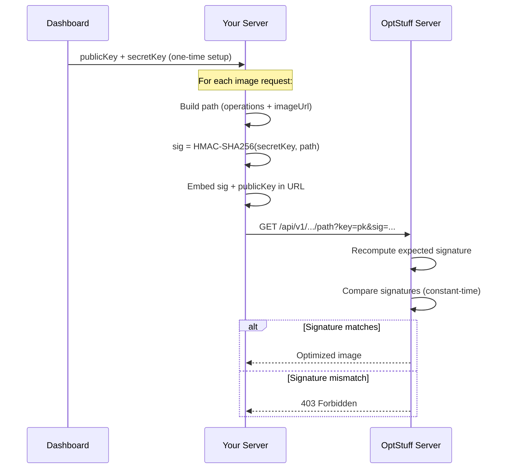

Every OptStuff image request requires a cryptographic signature to prove the URL was authorized. This guide covers how signing works and how to implement it.

For a higher-level overview, see [Core Concepts](/introduction/core-concepts). For a complete integration walkthrough, see the [Integration Guide](/getting-started/integration-guide).

## How It Works

There are three actors in the signing system:

1. **Dashboard** — You create an API key and receive a `publicKey` + `secretKey` pair (one-time setup)
2. **Your Server** — For each image, your server computes a signature using the `secretKey` and embeds it in the URL
3. **OptStuff Server** — On each request, it recomputes the expected signature and compares it to the one in the URL

The server doesn't maintain a list of valid URLs. A matching signature **is** the authorization proof.



## Signature Formula

```
signature = HMAC-SHA256(secretKey, payload)
             .digest("base64url")
             .substring(0, 32)
```

Where `payload` is:

- **With expiration:** `{operations}/{imageUrl}?exp={expiresAt}`
- **Without expiration:** `{operations}/{imageUrl}`

## Code Example

```typescript
import { createHmac } from "crypto";

function createSignedUrl(options: {
  readonly projectSlug: string;
  readonly publicKey: string;
  readonly secretKey: string;
  readonly operations: string;
  readonly imageUrl: string;
  readonly expiresAt: number | undefined;
}): string {
  const path = `${options.operations}/${options.imageUrl}`;
  const payload = options.expiresAt
    ? `${path}?exp=${options.expiresAt}`
    : path;

  const signature = createHmac("sha256", options.secretKey)
    .update(payload)
    .digest("base64url")
    .substring(0, 32);

  const params = new URLSearchParams({
    key: options.publicKey,
    sig: signature,
    ...(options.expiresAt && { exp: String(options.expiresAt) }),
  });

  return `/api/v1/${options.projectSlug}/${path}?${params.toString()}`;
}
```

### Usage

```typescript
const url = createSignedUrl({
  projectSlug: "my-blog",
  publicKey: "pk_abc123",
  secretKey: "sk_your_secret_key",
  operations: "w_800,f_webp",
  imageUrl: "cdn.example.com/photo.jpg",
  expiresAt: Math.floor(Date.now() / 1000) + 3600, // 1 hour
});
```

## Signature Expiration

The optional `exp` parameter limits how long a signed URL remains valid, preventing replay attacks.

| Use Case | Recommended Expiration |
|----------|----------------------|
| Static page images | 24 hours (86400 seconds) |
| Dynamic content | 1 hour (3600 seconds) |
| Temporary share links | 15 minutes (900 seconds) |
| Testing | 5 minutes (300 seconds) |

When `exp` is set, it **must** be included in both the signed payload and the URL query string.

## Security Properties

| Property | Benefit |
|----------|---------|
| **One-way function** | A captured signature cannot reveal the `secretKey` |
| **Constant-time comparison** | Prevents [timing attacks](https://en.wikipedia.org/wiki/Timing_attack) via `timingSafeEqual` |
| **32-character output** | Brute force is computationally infeasible |
| **Encrypted storage** | The `secretKey` is AES-256-GCM encrypted at rest; shown only once at creation |

## Common Mistakes

If you get `403 Invalid or expired signature`, see [Troubleshooting Signature Errors](/api-reference/error-codes#troubleshooting-signature-errors) in Error Codes.

## Related Documentation

- [Integration Guide](/getting-started/integration-guide) — Full integration walkthrough ([TypeScript](/getting-started/integration-guide/typescript) · [Next.js](/getting-started/integration-guide/nextjs))
- [API Endpoint](/api-reference/endpoint) — URL format and parameter reference
- [Error Codes](/api-reference/error-codes) — Troubleshooting failed requests
