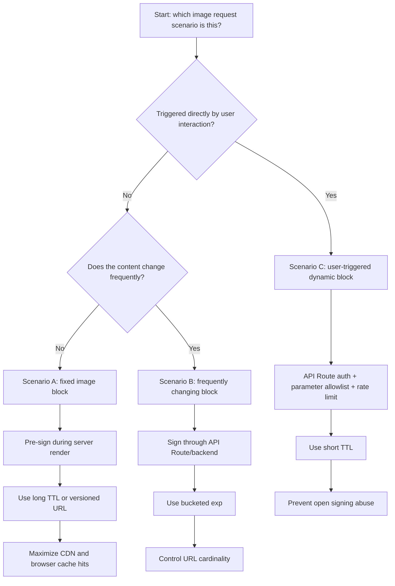
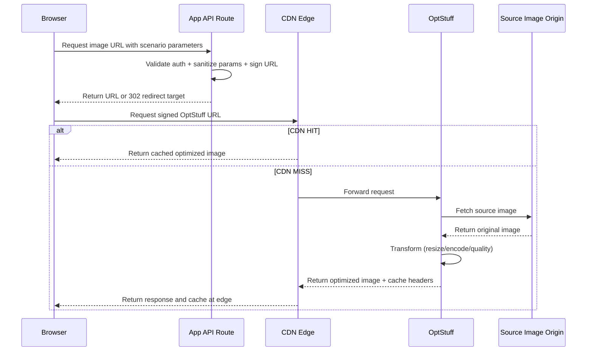

The hard part of image optimization is usually not "can we optimize images?" but "which signing and caching strategy should we use for each UI pattern?"

This guide maps OptStuff to three common scenarios:

1. Fixed image blocks (rarely changes)
2. Frequently changing blocks (updates regularly, but not on every interaction)
3. User-triggered dynamic blocks (new image requests generated after user actions)

## Core Principle

OptStuff URLs are content-addressable:

- same input parameters -> same URL
- same URL -> same output
- different parameters or `exp` -> different cache key

Because of this property, long-lived caching is safe when your URL shape remains stable.

## Scenario Matrix

| Scenario | Typical Example | Change Frequency | Recommended Signing Location | Recommended `exp` Strategy | Primary Goal |
|---|---|---|---|---|---|
| Fixed image block | Hero image, brand visuals, long-lived campaign assets | Low | Server Component / backend render | Long TTL (`24h` to `7d`) or versioned URL | Max cache hit ratio and stable LCP |
| Frequently changing block | Product cards, article lists, rotating banners | Medium | API Route or backend | Bucketed `exp` (hour/day windows) | Balance freshness and cache efficiency |
| User-triggered dynamic block | Filtered galleries, interactive previews, personalized recommendations | Event-driven | API Route (with auth + validation) | Short TTL (`1-10 min`) | Fast response with abuse protection |

## Decision Flow

## Scenario A: Fixed Image Block

Use this for above-the-fold hero images, brand assets, and other images that rarely change.

Recommended pattern:

- sign URLs in Server Components or backend templates
- use a longer validity window (`exp`)
- keep URL shape deterministic (avoid random params)
- preload the primary hero image (`preload`, or `priority` on older Next.js versions)

Why this works:

- stable URLs -> better CDN/browser reuse
- fewer runtime signing requests
- more consistent LCP performance

## Scenario B: Frequently Changing Block

Use this when content updates regularly, but not on every click.

Recommended pattern:

- sign in API Routes or backend services
- use bucketed expiration (for example, hourly windows)
- standardize width breakpoints to reduce URL variants
- keep operation presets consistent across similar components

Common anti-pattern:

- generating `exp = now + ttl` on every render creates a new URL each time and severely hurts cache hit ratio

## Scenario C: User-Triggered Dynamic Block

Use this when new image requests are created after explicit user actions (filtering, mode switches, live previews, personalization).

Recommended pattern:

- frontend calls your API Route to request signed URLs
- API Route verifies session/token
- API Route validates input (`w`, `h`, `q`, `f`, source host)
- API Route applies rate limiting and short `exp`
- frontend uses debounce/abort to avoid bursty duplicate requests

Security baseline:

- never expose `OPTSTUFF_SECRET_KEY` in client bundles
- never allow signing endpoints to become unauthenticated open oracles

## End-to-End Request Flow

## Suggested Defaults

| Parameter | Fixed block | Frequently changing block | User-triggered block |
|---|---|---|---|
| `exp` | `24h-7d` | `1h-24h` bucketed | `1-10m` |
| Signing location | Server render | API Route / backend | API Route with auth |
| Cache focus | Maximum reuse | Reuse + bounded freshness | Controlled freshness |
| Risk controls | Versioned URLs | Bucketing + width standardization | Allowlist + rate limit + auth |

## Pre-Launch Checklist

- [ ] secret key is server-only and never exposed in browser code
- [ ] signing logic runs only in Server Components or API Routes
- [ ] source-domain allowlist is configured
- [ ] operation parameter validation exists in app-side API Route
- [ ] `exp` strategy matches each scenario
- [ ] common widths are standardized to prevent URL explosion
- [ ] CDN hit headers are monitored (`cf-cache-status`, `x-vercel-cache`, `x-cache`)

## Related Documentation

- [API Endpoint](/api-reference/endpoint) - Request format and response headers
- [URL Signing](/guides/url-signing) - Signature rules and `exp` behavior
- [CDN and Caching](/guides/cdn-caching) - CDN strategy and cache-hit tuning
- [Custom next/image Loader](/guides/nextjs-image-loader) - Responsive image loading with server-side signing
