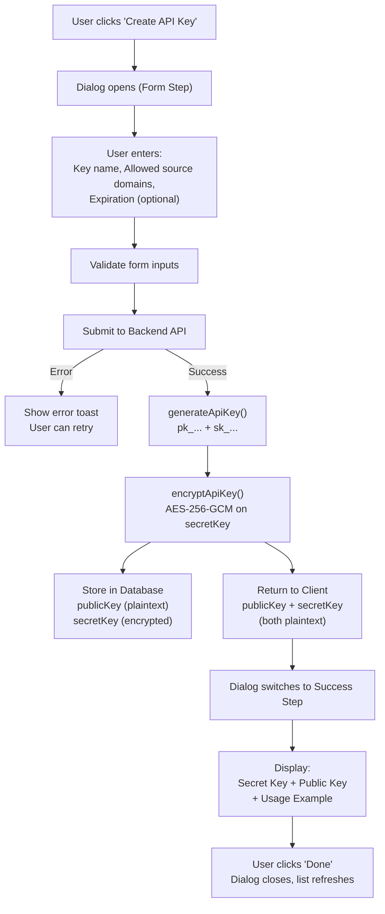

When a user creates an API key, the system generates a dual-key pair, encrypts the secret key with AES-256-GCM, and presents both keys in a one-time success screen. This document covers the full flow: UI interaction, backend processing, encryption, and database storage.

## Overview

Users create API keys to authenticate image transformation requests. Each API key consists of a **public key** (`pk_...`, for identification) and a **secret key** (`sk_...`, for URL signing). The full public key can be viewed and copied from the API key list. The secret key is only shown once at creation or rotation time.

## Flow Diagram

## Key Concepts

### API Key Structure

| Component | Format | Description |
|-----------|--------|-------------|
| Public Key | `pk_` + 16 bytes (base64url) = 25 chars | Public identifier, stored in plaintext. Used in URL `?key=` param |
| Secret Key | `sk_` + 32 bytes (base64url) | Used for HMAC-SHA256 URL signing, stored encrypted |

### Encryption

| Aspect | Details |
|--------|---------|
| Algorithm | AES-256-GCM (authenticated encryption) |
| Key Derivation | HKDF (RFC 5869) from master secret |
| Storage | Only `secretKey` is encrypted; `publicKey` is stored in plaintext |

### Form Fields

| Field | Required | Description |
|-------|----------|-------------|
| Key Name | Yes | Descriptive name (e.g., "Production", "Development") |
| Allowed Source Domains | Yes | Which image sources this key can access |
| Expiration | No | Optional expiry date for automatic key invalidation |

## User Journey

### 1. Open Create Dialog

User navigates to a project's API Keys section and clicks the **"Create API Key"** button.

### 2. Fill Out Form

The dialog presents a form with:

1. **Key Name** — Input field for a descriptive name
2. **Allowed Source Domains** — Domain list input with add/remove functionality
3. **Expiration** — Select dropdown with preset options (30 days, 90 days, etc.)

### 3. Submit Form

When the user clicks "Create Key":

1. Frontend validates inputs (name required, at least 1 domain)
2. Sends request to `apiKey.create` tRPC mutation
3. Button shows loading state during request

### 4. Backend Processing

The backend:

1. Generates cryptographically secure publicKey and secretKey
2. Encrypts secretKey using AES-256-GCM (publicKey is stored in plaintext)
3. Stores values in database
4. Returns publicKey and plaintext secretKey to client

### 5. Success Screen

Dialog transitions to success view showing:

1. **Secret Key** — Full secret key with copy button and warning
2. **Public Key** — Public identifier for URL `?key=` parameter
3. **Usage Example** — Code snippet showing how to sign URLs

> ⚠️ **Important**: The secret key is only shown once. Users must copy and save it securely.
>
> The public key (`pk_...`) can always be copied later from the API key list page (displayed masked with a copy button).

### 6. Complete

User clicks "Done" to close the dialog. The API key list automatically refreshes to show the new key.

## Error Scenarios

| Scenario | Behavior |
|----------|----------|
| Empty key name | Submit button disabled |
| No source domains | Submit button disabled |
| Network error | Show error toast, user can retry |
| Server error | Show error toast with message |
| Duplicate name | Show validation error (if enforced) |

## Form Validation Rules

| Field | Validation |
|-------|------------|
| Key Name | Required, non-empty after trim |
| Source Domains | At least 1 domain required |
| Expiration | Optional, must be future date if set |

## Related Files

| File | Purpose |
|------|---------|
| `src/modules/project-detail/ui/components/create-api-key-dialog.tsx` | Dialog component with form and success states |
| `src/modules/project-detail/ui/components/domain-list-input.tsx` | Domain input component |
| `src/modules/project-detail/ui/components/expiration-select.tsx` | Expiration dropdown component |
| `src/server/lib/api-key.ts` | Key generation and encryption functions |
| `src/server/api/routers/api-key.ts` | Backend tRPC router for API key operations |
| `src/modules/project-detail/ui/components/api-key-types.ts` | TypeScript types for API key data |

## Database Schema

The `api_keys` table stores:

| Column | Type | Description |
|--------|------|-------------|
| `id` | UUID | Primary key |
| `projectId` | UUID | Foreign key to projects table |
| `name` | String | User-defined key name |
| `publicKey` | String | Public identifier (plaintext, unique, indexed) |
| `secretKey` | String | Secret key (AES-256-GCM encrypted) |
| `allowedSourceDomains` | String[] | Allowed image source domains |
| `expiresAt` | Timestamp | Optional expiration date |
| `createdAt` | Timestamp | Creation timestamp |
| `lastUsedAt` | Timestamp | Last usage timestamp |
| `revokedAt` | Timestamp | Revocation timestamp (null if active) |

## Security Considerations

1. **Secret Key Display** — Only shown once at creation or rotation, never retrievable again
2. **Public Key Display** — Public key (`pk_...`) is available in the API key list (masked display with copy button). Since it's a public identifier without signing capability, this is safe to expose
3. **Encryption at Rest** — Secret key encrypted using HKDF-derived AES-256-GCM; public key stored in plaintext
4. **Domain Restrictions** — Keys are scoped to specific source domains
5. **Expiration** — Optional automatic key invalidation
6. **Audit Trail** — `createdAt`, `lastUsedAt`, `revokedAt` timestamps

## Related Documentation

- [URL Signing](/guides/url-signing) — Request signing and authentication
- [Security Best Practices](/guides/security-best-practices) — Key management recommendations
- [What is OptStuff?](/introduction/what-is-optstuff) — Service overview
