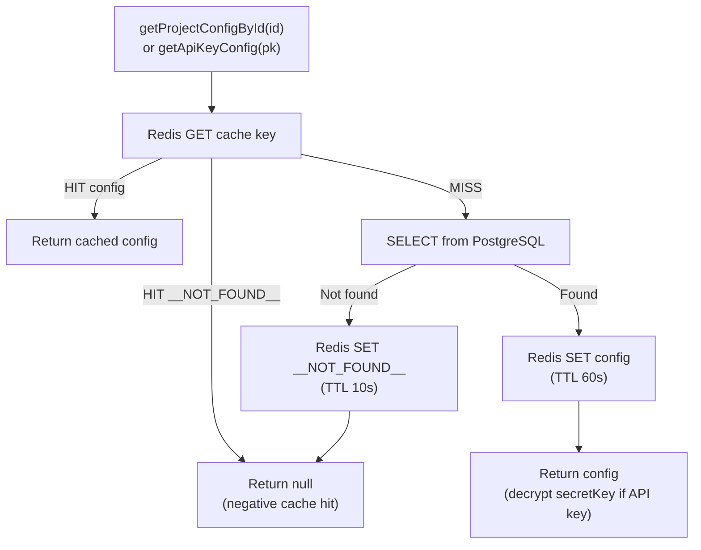
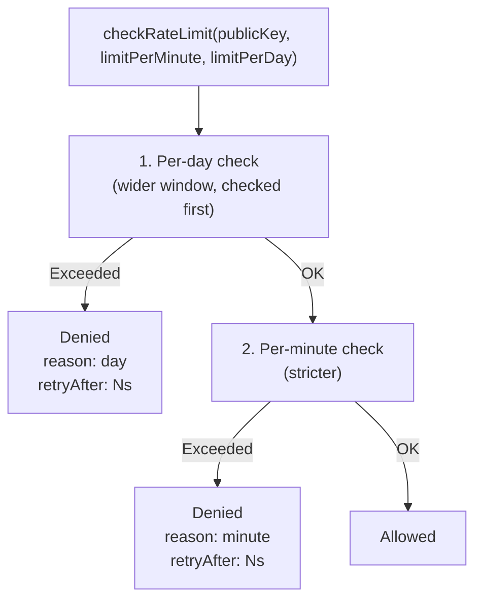
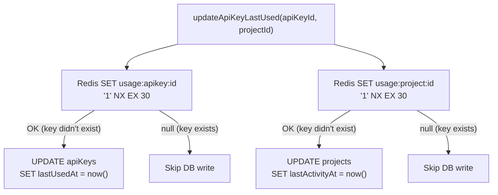

The caching layer uses Redis for three purposes: configuration caching, rate limiting, and write throttling. All keys have a TTL — nothing persists indefinitely.

For the user-facing rate limiting guide (behavior, configuration, tuning), see [Rate Limiting](/guides/rate-limiting).

---

## Key Schema Overview

All Redis keys use a structured prefix convention. Every key has a TTL — no key persists indefinitely.

| Prefix | Purpose | TTL | Example |
|--------|---------|-----|---------|
| `cache:project:id:` | Project config cache (by ID) | 60s | `cache:project:id:uuid-123` |
| `cache:project:slug:` | Project config cache (by slug) | 60s | `cache:project:slug:my-blog` |
| `cache:project:team-slug:` | Team+Project config cache | 60s | `cache:project:team-slug:acme/my-blog` |
| `cache:apikey:pk:` | API key config cache | 60s | `cache:apikey:pk:pk_abc123` |
| `ratelimit:ipx:minute:` | Per-minute rate limit counter | ~60s | `ratelimit:ipx:minute:pk_abc123` |
| `ratelimit:ipx:day:` | Per-day rate limit counter | ~24h | `ratelimit:ipx:day:pk_abc123` |
| `usage:apikey:` | API key write throttle lock | 30s | `usage:apikey:uuid-123` |
| `usage:project:` | Project write throttle lock | 30s | `usage:project:uuid-456` |

---

## Configuration Cache (Cache-Aside)

**File:** `src/server/lib/config-cache.ts`
**Pattern:** Cache-Aside (Lazy Population)

### Cached Data

Every image request requires two database lookups before processing:

1. **ProjectConfig** — project ID, slug, team ID, allowed referer domains
2. **ApiKeyConfig** — key ID, secret key (stored encrypted in cache, decrypted on read), allowed source domains, expiration, revocation status, rate limits

### Read Flow



### TTL Values

```text
Positive cache:  60 seconds (CACHE_TTL_SECONDS)
Negative cache:  10 seconds (NEGATIVE_CACHE_TTL_SECONDS)
```

A shorter TTL gives fresher data but more database queries. A longer TTL gives better hit rates but delays propagation of changes. 60 seconds balances both — admin operations bypass this via active invalidation, so the TTL only matters for the rare case where invalidation fails.

### Cache Key Formats

| Data | Key Format | Example |
|------|------------|---------|
| Project (by ID) | `cache:project:id:{projectId}` | `cache:project:id:uuid-123` |
| Project (by slug) | `cache:project:slug:{slug}` | `cache:project:slug:my-blog` |
| Project (by team + slug) | `cache:project:team-slug:{teamSlug}/{projectSlug}` | `cache:project:team-slug:acme/my-blog` |
| API Key (by public key) | `cache:apikey:pk:{publicKey}` | `cache:apikey:pk:pk_abc123` |

### Negative Caching

When a lookup returns no result (project not found / key not found), a sentinel value (`__NOT_FOUND__`) is cached with a **shorter TTL of 10 seconds**. This prevents repeated requests for non-existent slugs or public keys (e.g. probing attacks) from hitting the database on every request.

The shorter TTL ensures that when a resource is later created, it becomes visible within 10 seconds — much faster than the full 60-second positive cache TTL. Active invalidation also clears negative cache entries immediately.

### Invalidation

Cache entries are removed in two ways:

1. **Automatic** — Redis evicts the key after TTL expires.
2. **Manual (immediate)** — Dashboard mutations call invalidation functions:

| Dashboard Action | Invalidation Function | Effect |
|------------------|-----------------------|--------|
| Update project settings | `invalidateProjectCache(slug, projectId?)` | Deletes all cache entries for that project (slug, ID, team+slug) |
| Delete project | `invalidateProjectCache(slug, projectId?)` + invalidate all project API keys | Clears project and all associated key caches |
| Revoke / update API key | `invalidateApiKeyCache(publicKey)` | Deletes the cache entry for that public key |

### Serialization and Secret Handling

`ApiKeyConfig` requires special handling for Redis storage:

- **Secret keys** are stored in their **encrypted form** (`encryptedSecretKey`) in Redis — never as plaintext — and are only decrypted via `decryptApiKey()` after retrieval from cache. This prevents leaking secrets to the Redis layer.
- **Date fields** (`expiresAt`, `revokedAt`) are stored as ISO 8601 strings since JSON has no native Date type, and converted back to `Date` objects on read.

A dedicated `CachedApiKeyConfig` type enforces both transformations at compile time.

### Why Revoked Keys Are Cached

The database query in `getApiKeyConfig` deliberately does **not** filter by `revokedAt IS NULL`. This ensures that when the cache refreshes from the database, the `revokedAt` timestamp is present in the cached entry. The route handler then performs a defense-in-depth check: if `apiKey.revokedAt` is set, the request is rejected with `401`.

Without this, the filter would cause revoked keys to return `null` from the database — indistinguishable from a non-existent key — making the route handler's revocation check dead code.

Active invalidation via `invalidateApiKeyCache` remains the primary revocation mechanism; caching `revokedAt` acts as a safety net for stale entries.

---

## Rate Limiting (Sliding Window)

**File:** `src/server/lib/rate-limiter.ts`
**Pattern:** Sliding Window Counter (via `@upstash/ratelimit`)

### Implementation Flow



### Redis Key Prefixes

| Layer | Redis Key Prefix | Window |
|-------|-------------------|--------|
| Per-day | `ratelimit:ipx:day:` | 24 hours |
| Per-minute | `ratelimit:ipx:minute:` | 1 minute |

### Check Order Rationale

The per-day limit is checked **first**. This is deliberate: Upstash's `.limit()` is a consume-and-check operation — it decrements the counter atomically before returning the result. If the minute limit were checked first, a successful minute check would consume a minute token; a subsequent day rejection would block the request, but the minute token is already spent. Checking the day limit first inverts the problem: if day fails, no minute token is consumed.

> **Note:** Upstash also provides a non-consuming `getRemaining()` method that can query remaining tokens without decrementing. This could be used as a pre-check to avoid any token waste, at the cost of an extra Redis round trip per request. The current order-swap approach avoids this overhead while eliminating the most impactful waste scenario.

### Default Fallback Values

Rate limits are per API key and stored in the database. When `null`, fallback values are applied in `config-cache.ts`:

```typescript
rateLimitPerMinute: apiKey.rateLimitPerMinute ?? 60,    // default fallback
rateLimitPerDay: apiKey.rateLimitPerDay ?? 10000,       // default fallback
```

### Instance Lifecycle

`Ratelimit` instances are lightweight configuration objects — they hold a reference to the shared Redis client, the window algorithm, and a key prefix. They are stateless: all actual counters live in Redis. Instances are created inline per `checkRateLimit` call rather than cached in-memory, because the construction cost is negligible and avoiding module-level `Map` state simplifies the code for serverless environments where containers are recycled frequently.

### Resetting Counters

For testing or administrative purposes, use the `resetRateLimit` function:

```typescript
import { resetRateLimit } from "@/server/lib/rate-limiter";

await resetRateLimit("pk_abc123");
```

This clears the sliding window counters in Redis for the specified key prefix.

### Analytics

Rate limit instances are created with `analytics: true`, which sends usage metrics to the Upstash dashboard. You can view rate limit hit/miss statistics at [console.upstash.com](https://console.upstash.com).

---

## Write Throttling (SET NX)

**File:** `src/server/lib/usage-tracker.ts`
**Pattern:** Distributed Lock via SET NX (Set-If-Not-Exists)

### Implementation Flow



### Atomicity Guarantee

`SET key value NX EX 30` is atomic in Redis. Even if 10 serverless instances execute it simultaneously for the same key, exactly one succeeds:

```text
T=0:
  Instance A: SET usage:apikey:abc "1" NX EX 30 → "OK"    (writes DB)
  Instance B: SET usage:apikey:abc "1" NX EX 30 → null     (skips)
  Instance C: SET usage:apikey:abc "1" NX EX 30 → null     (skips)

T=30 (key expires):
  Instance D: SET usage:apikey:abc "1" NX EX 30 → "OK"    (writes DB)
```

### Why SET NX Instead of In-Memory Batching

A previous design used an in-memory `Map` with `setTimeout` to batch writes every 5 seconds. This fails in serverless because:

1. `setTimeout` does not fire if the container is recycled before the timer
2. Pending updates in the `Map` are permanently lost on container recycle
3. Multiple instances maintain separate Maps, limiting deduplication effectiveness

`SET NX EX` solves all three problems: it is a single atomic Redis command with no dependency on timers, container lifecycle, or instance-local state.

### Execution Model

Write throttling runs as **fire-and-forget** — it does not `await` the result and does not block the image response. Errors are caught and logged to `console.error` but never propagated to the caller.

---

## Data Durability

Redis contains **zero persistent data**. Every key falls into one of three categories:

| Category | Source of Truth | If Redis Is Wiped |
|----------|----------------|-------------------|
| Config cache | PostgreSQL | Next request refills from database (higher latency for one request) |
| Rate limit counters | None (ephemeral by nature) | Counters reset to zero (briefly allows over-limit requests) |
| Write throttle locks | None (control flags) | Triggers one extra database UPDATE per key (harmless) |

---

## Related Documentation

| Document | Description |
|----------|-------------|
| [Rate Limiting](/guides/rate-limiting) | User-facing rate limiting guide |
| [System Overview](/internal/system-overview) | Full system architecture |
| [Domain Whitelisting](/guides/domain-whitelisting) | Domain whitelist configuration |
| [Security Best Practices](/guides/security-best-practices) | Security recommendations |
