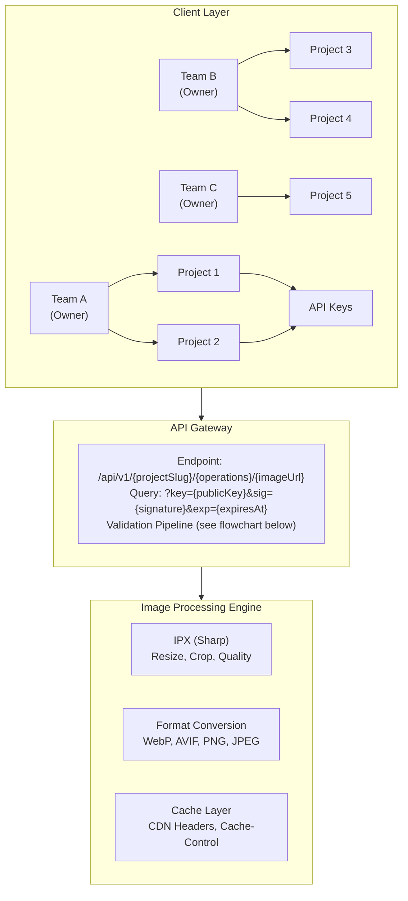
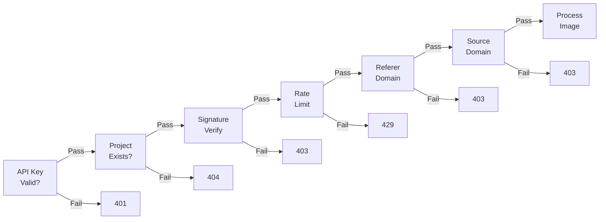
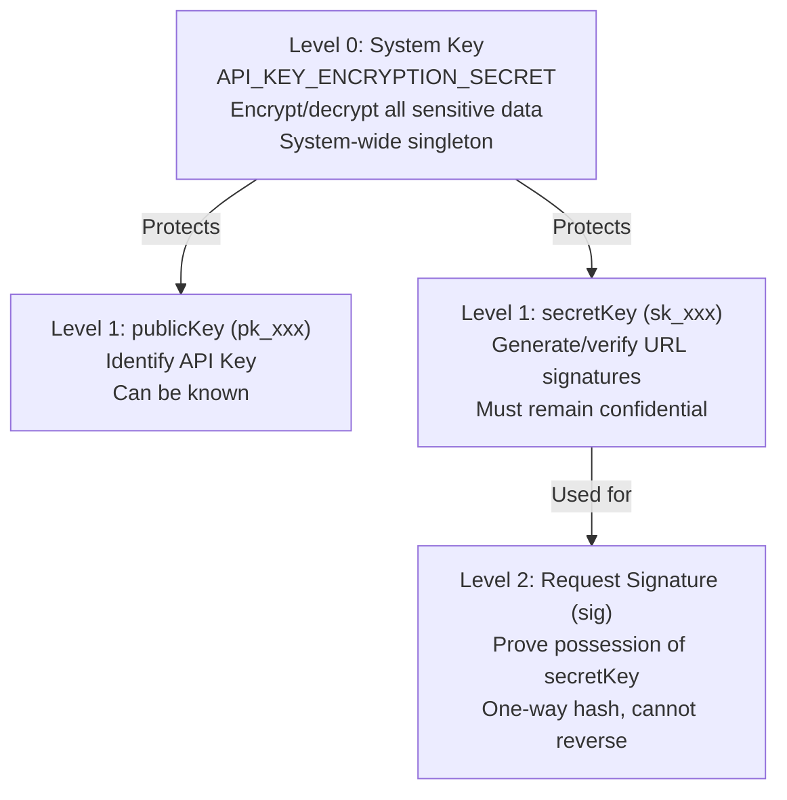
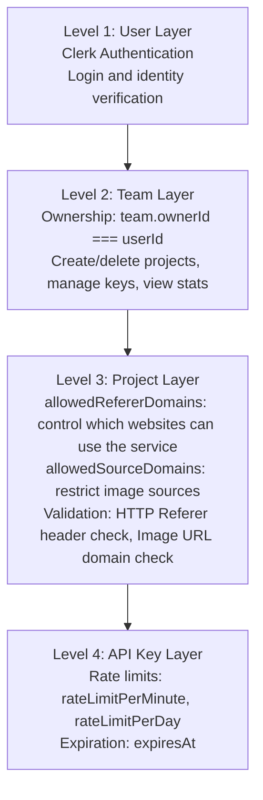
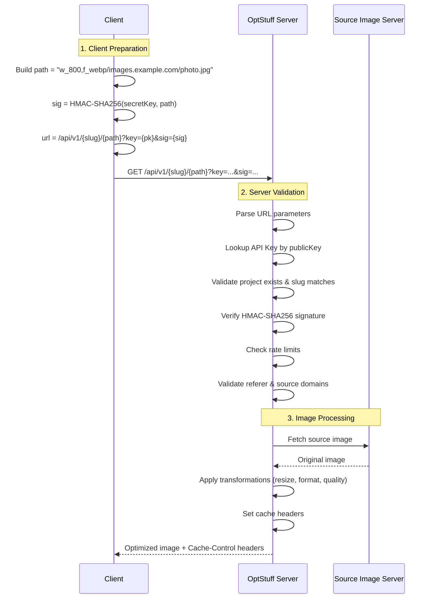

OptStuff is a multi-tenant image optimization API with on-the-fly transformation, cryptographic URL signing, and fine-grained access control. This overview covers the system architecture, security model, and core components — each section links to the relevant detailed documentation.

## Key Capabilities

- **On-Demand Optimization**: Transform images dynamically via URL parameters
- **Multi-Layer Security**: HMAC-SHA256 URL signing, AES-256-GCM encryption, domain whitelisting
- **Multi-Tenant Architecture**: Teams, projects, and API keys hierarchy
- **Usage Analytics**: Real-time monitoring and bandwidth tracking
- **CDN-Friendly**: Long-lived caching headers for edge deployment

## System Architecture

### Validation Pipeline

Each request passes through six validation steps before processing. For the full step-by-step breakdown, see [API Endpoint — Authentication Flow](/api-reference/endpoint#authentication-flow).

## Core Components

### 1. Multi-Tenant Resource Hierarchy

The system implements a three-level hierarchy for resource organization:

| Level | Entity | Description |
|-------|--------|-------------|
| 1 | **Team** | Top-level organization unit (personal or shared workspace) |
| 2 | **Project** | Isolated environment within a team for different applications |
| 3 | **API Key** | Granular access credential bound to a specific project |

### 2. Authentication System

User authentication is handled by **Clerk**, providing:

- Social login (Google, GitHub, etc.)
- Email/password authentication
- Session management
- User identity verification

### 3. API Key Management

Each API key consists of a dual-key pair: a public key (`pk_...`) for identification and a secret key (`sk_...`) for URL signing. For the full key lifecycle (creation, rotation, revocation, expiration), see [Key Management](/guides/key-management). For the internal creation flow, see [Create API Key Flow](/internal/create-api-key-flow).

### 4. Image Processing Engine

Built on **IPX** (powered by **Sharp**), the engine supports:

| Operation | Parameter | Example |
|-----------|-----------|---------|
| Width | `w_` | `w_800` |
| Height | `h_` | `h_600` |
| Quality | `q_` | `q_80` |
| Format | `f_` | `f_webp`, `f_avif` |
| Fit | `fit_` | `fit_cover`, `fit_contain` |
| Scale | `s_` | `s_0.5` |

### 5. Usage Analytics

Real-time tracking and monitoring includes:

- Request counts (per minute, daily, monthly)
- Bandwidth consumption
- Per-API-key usage breakdown
- Recent request logs
- Top requested images
- Bandwidth savings metrics

## Security Architecture

### Three-Tier Key Hierarchy

### Encryption Mechanisms

| Mechanism | Algorithm | Purpose |
|-----------|-----------|---------|
| Key Derivation | HKDF (RFC 5869) with SHA-256 | Derive encryption key from master secret |
| Data Encryption | AES-256-GCM | Encrypt secret keys at rest |
| URL Signing | HMAC-SHA256 | Sign image request URLs |
| Signature Comparison | `timingSafeEqual` | Prevent timing attacks |

### Four-Layer Permission Model

### Domain Whitelist Architecture

Two layers of domain whitelisting protect the service. For configuration details, see [Domain Whitelisting](/guides/domain-whitelisting).

| Layer | Setting | Question Answered | Validation Method |
|-------|---------|-------------------|-------------------|
| Project | `allowedRefererDomains` | Who can **use** this service? | HTTP Referer header |
| Project | `allowedSourceDomains` | Which **image sources** can be processed? | Image URL in request |

## Request Flow

### Image Request Lifecycle

### API Key Lifecycle

| Phase | Actions |
|-------|---------|
| **Creation** | Generate key pair → Encrypt → Store in DB → Return to user (once) |
| **Usage** | Sign URLs with secretKey → Server validates signature |
| **Rotation** | Revoke old key + Create new key atomically (DB transaction, inherits settings) → Clear cache → Update application |
| **Revocation** | Mark as revoked → Clear cache → Reject future requests |

## Rate Limiting

| Limit Type | Range | Default | Description |
|------------|-------|---------|-------------|
| Per-minute | 1–10,000 | 60 | Rolling window rate limit |
| Per-day | 1–1,000,000 | 10,000 | Calendar day limit |

## Technical Specifications

| Specification | Details |
|---------------|---------|
| Encryption | AES-256-GCM with HKDF key derivation |
| Signing | HMAC-SHA256 (32-character output) |
| Image Engine | IPX (powered by Sharp) |
| Supported Input Formats | JPEG, PNG, WebP, AVIF, GIF |
| Supported Output Formats | JPEG, PNG, WebP, AVIF |
| Authentication Provider | Clerk |
| Database | PostgreSQL (via Drizzle ORM) |
| Framework | Next.js (App Router) |

## Attack Protections

| Attack Type | Protection Mechanism |
|-------------|---------------------|
| Brute force | HMAC-SHA256 + 32-char output makes collision computationally infeasible |
| Replay attacks | `exp` expiration parameter limits signature validity |
| Timing attacks | `timingSafeEqual` constant-time comparison |
| Data theft | AES-256-GCM encrypted storage protects database leaks |
| Man-in-the-middle | HTTPS + signature validation provides dual protection |
| Hotlinking | Referer domain whitelist prevents unauthorized embedding |
| Unauthorized sources | Source domain whitelist restricts image origins |

## Error Handling

For the complete error code list with causes and solutions, see [Error Codes](/api-reference/error-codes).

## Related Documentation

| Document | Description |
|----------|-------------|
| [What is OptStuff?](/introduction/what-is-optstuff) | Product-focused service description |
| [Domain Whitelisting](/guides/domain-whitelisting) | Domain whitelist configuration |
| [Integration Guide](/getting-started/integration-guide) | Step-by-step integration tutorial |
| [URL Signing](/guides/url-signing) | Request signing and validation |
| [Security Best Practices](/guides/security-best-practices) | Security recommendations |
