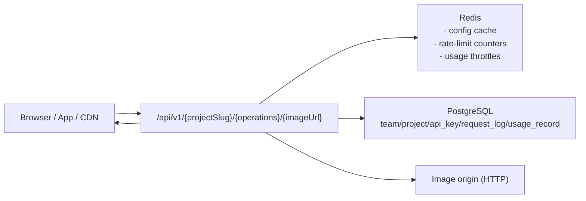
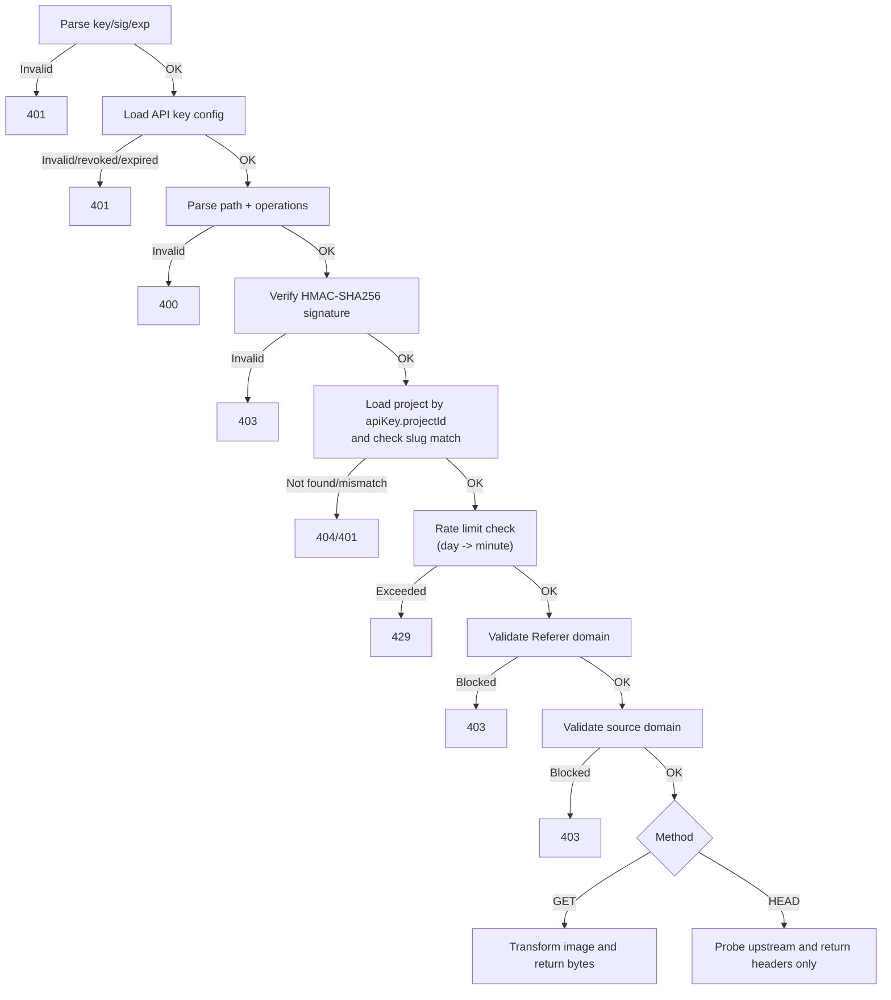
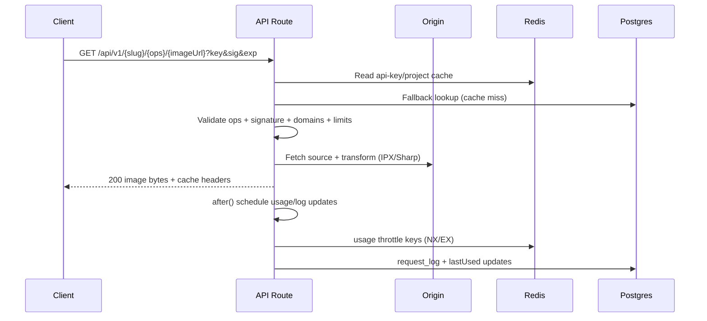

OptStuff is a multi-tenant image optimization service composed of a public image API, dashboard control plane, and shared storage/caching layers. This page is the implementation-level reference for how those pieces work together.

## Component Map

| Component | Responsibility | Main files |
|-----------|----------------|------------|
| **Image API Gateway** | Handles `GET`/`HEAD` image requests and enforces all request checks | `src/app/api/v1/[projectSlug]/[...path]/route.ts` |
| **Validation utilities** | Parses signature params, validates operations and domain rules | `src/server/lib/validators.ts`, `src/lib/ipx-utils.ts` |
| **Crypto & key handling** | API key generation, encryption/decryption, signature verification | `src/server/lib/api-key.ts` |
| **Config cache** | Caches project/API-key configs (positive + negative cache) | `src/server/lib/config-cache.ts` |
| **Rate limiter** | Per-day and per-minute sliding-window checks | `src/server/lib/rate-limiter.ts` |
| **Image engine** | Fetch + transform using IPX/Sharp | `src/server/lib/ipx-factory.ts` |
| **Observability** | Request logging and activity/usage updates | `src/server/lib/request-logger.ts`, `src/server/lib/usage-tracker.ts` |
| **Control plane (tRPC)** | Team/project/API-key management | `src/server/api/routers/*.ts` |
| **Auth & route guard** | Clerk auth + service-route bypass for `/api/v1` | `src/server/api/trpc.ts`, `src/proxy.ts` |

## End-to-End Architecture


```mermaid
flowchart LR
  Client["Browser / App / CDN"] --> Api["/api/v1/{projectSlug}/{operations}/{imageUrl}"]
  Api --> Redis["Redis\n- config cache\n- rate-limit counters\n- usage throttles"]
  Api --> Pg["PostgreSQL\nteam/project/api_key/request_log/usage_record"]
  Api --> Origin["Image origin (HTTP)"]
  Api --> Client
```

## Validation Pipeline (actual order)


```mermaid
flowchart TD
  A["Parse key/sig/exp"] -->|Invalid| E1["401"]
  A -->|OK| B["Load API key config"]
  B -->|Invalid/revoked/expired| E2["401"]
  B -->|OK| C["Parse path + operations"]
  C -->|Invalid| E3["400"]
  C -->|OK| D["Verify HMAC-SHA256 signature"]
  D -->|Invalid| E4["403"]
  D -->|OK| F["Load project by apiKey.projectId\nand check slug match"]
  F -->|Not found/mismatch| E5["404/401"]
  F -->|OK| G["Rate limit check\n(day -> minute)"]
  G -->|Exceeded| E6["429"]
  G -->|OK| H["Validate Referer domain"]
  H -->|Blocked| E7["403"]
  H -->|OK| I["Validate source domain"]
  I -->|Blocked| E8["403"]
  I -->|OK| J{"Method"}
  J -->|GET| K["Transform image and return bytes"]
  J -->|HEAD| L["Probe upstream and return headers only"]
```

### Why this order

- Signature verification happens before expensive project/rate-limit work on invalid traffic.
- Project is loaded by `apiKey.projectId` first, then slug is matched to prevent cross-project confusion.
- Rate limiting runs after signature verification so invalid requests cannot consume quota.

## Request Flows

### 1) Signed `GET` flow


```mermaid
sequenceDiagram
  participant C as Client
  participant A as API Route
  participant O as Origin
  participant R as Redis
  participant P as Postgres

  C->>A: GET /api/v1/{slug}/{ops}/{imageUrl}?key&sig&exp
  A->>R: Read api-key/project cache
  A->>P: Fallback lookup (cache miss)
  A->>A: Validate ops + signature + domains + limits
  A->>O: Fetch source + transform (IPX/Sharp)
  A-->>C: 200 image bytes + cache headers
  A->>A: after() schedule usage/log updates
  A->>R: usage throttle keys (NX/EX)
  A->>P: request_log + lastUsed updates
```

### 2) `HEAD` fast-path flow

- Reuses the same auth/abuse validation pipeline as `GET`.
- Performs a lightweight upstream `HEAD` probe (no image transform).
- Returns header-only responses with `X-Head-Fast-Path: 1`.

## Data Model & Tenancy

```text
team
 └── project
      └── api_key
```

| Entity | Notes |
|--------|------|
| `team` | Ownership boundary (one personal team per user via onboarding) |
| `project` | Holds domain security settings and aggregate usage metadata |
| `api_key` | Public/secret pair, expiry, revocation, per-key rate-limit values |
| `usage_record` | Aggregated usage rows |
| `request_log` | Per-request operational telemetry (sanitized URL) |

## Security Model

| Layer | Mechanism | Notes |
|-------|-----------|------|
| URL auth | HMAC-SHA256 signature | Constant-time compare, optional `exp` |
| Key storage | AES-256-GCM + HKDF | Secret keys encrypted at rest |
| Source control | `allowedSourceDomains` | Production empty-list is fail-closed |
| Hotlinking control | `allowedRefererDomains` | Missing `Referer` is allowed by design |
| Abuse control | Per-key rate limiting | Day window then minute window |

## Operational Notes

- **Cache propagation:** config cache TTL is 60s; negative cache TTL is 10s.
- **Rate-limiter availability:** Redis failures fail open (request allowed).
- **Request logging:** source URL is sanitized (query/hash removed); retention target is 30 days.
- **Original-size metric:** sampled (10%) to avoid extra upstream `HEAD` on every success.
- **HEAD upstream behavior:** non-image content-type probes are treated as transform-ineligible (`502`).

## Operations Reference (server validation)

| Operation | Example | Validation rule |
|-----------|---------|-----------------|
| `w` | `w_800` | Integer `1..8192` |
| `h` | `h_600` | Integer `1..8192` |
| `q` | `q_80` | Integer `1..100` |
| `f` | `f_webp` | `webp|avif|png|jpg` |
| `fit` | `fit_cover` | `cover|contain|fill` |
| `s` | `s_1200x630` | `{w}x{h}` with each `1..8192` |
| `embed` | `embed` | Flag only (no value) |

## Related Docs

- [API Endpoint](/api-reference/endpoint)
- [Redis Schema](/internal/redis-schema)
- [Create API Key Flow](/internal/create-api-key-flow)
- [User Onboarding Flow](/internal/user-onboarding-flow)
- [SSRF Prevention](/internal/ssrf-prevention)
