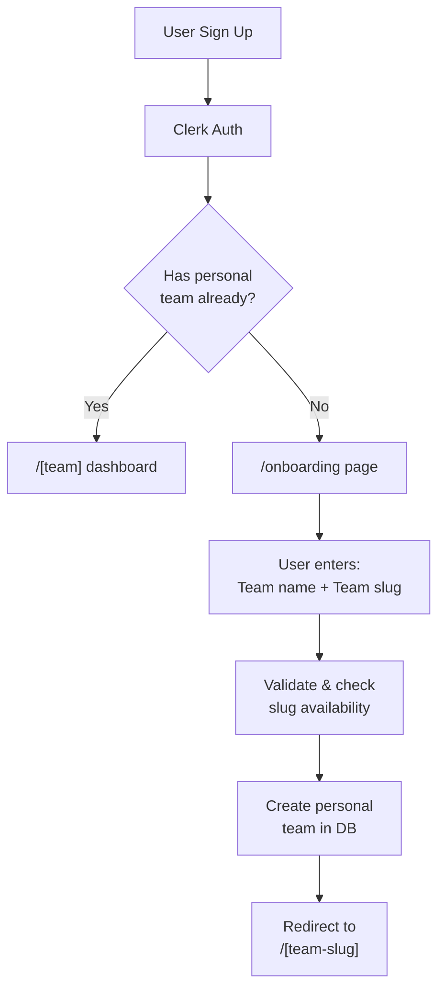

This document explains the complete user onboarding and getting-started flow in OptStuff Dashboard — from sign-up to having a working API key.

## Overview

When a new user signs up for OptStuff, they go through a streamlined journey:

1. **Create a personal team** — Required before accessing the dashboard
2. **Create a project** — Configure image sources, get a default API key automatically
3. **Copy their API key** — Shown immediately in the project creation dialog
4. **Integrate** — Documentation links are provided at every step



## Phase 1: Team Creation (Onboarding)

### Key Concepts

#### Personal Team

| Property | Description |
|----------|-------------|
| Unique per user | Each user has exactly **one** personal team |
| Required | Users cannot access the dashboard without a personal team |
| Non-deletable | Personal teams cannot be deleted |
| Extensible | Users can create additional (non-personal) teams later |

#### Team Slug

The slug is the URL identifier for a team (e.g., `optstuff.com/my-team`).

| Rule | Description |
|------|-------------|
| Length | 3–50 characters |
| Characters | Lowercase letters (`a-z`), numbers (`0-9`), hyphens (`-`) |
| Format | Must start and end with a letter or number |
| Uniqueness | Globally unique across all teams |

### User Journey

#### 1. Sign Up / Sign In

User authenticates via Clerk (email, Google, GitHub, etc.).

#### 2. Redirect Decision

After authentication, the system checks if the user has a personal team:

- **No personal team** → Redirect to `/onboarding`
- **Has personal team** → Redirect to `/[team-slug]` dashboard

#### 3. Onboarding Page

The onboarding page:

1. Pre-fills a suggested team name based on user profile (e.g., "John's Team")
2. Auto-generates a slug from the team name
3. Shows real-time slug availability feedback
4. Provides a "randomize" button for generating a random slug

#### 4. Team Creation

When the user submits the form:

1. Validates team name (1–255 characters)
2. Validates slug format and length
3. Checks slug availability (must be unique)
4. Creates the personal team record in database
5. Redirects to the new team's dashboard

### Error Scenarios

| Scenario | Behavior |
|----------|----------|
| Slug already taken | Show error, user must choose different slug |
| Invalid slug format | Show validation error with format requirements |
| User already has personal team | Redirect to existing team (shouldn't happen normally) |
| Network error | Show generic error, allow retry |

## Phase 2: Project Creation (with Default API Key)

After landing on the team dashboard, new users see an empty state prompting them to create their first project.

### CreateProjectDialog — Two-Step Flow

The dialog uses a two-step pattern (form → success):

#### Step 1: Form

- **Project Name** (required)
- **Description** (optional)
- **Image Sources** — where original images are hosted (e.g., `images.unsplash.com`, `cdn.mysite.com`). Subdomains are included automatically.
- **Authorized Websites** (optional) — which websites can display optimized images. Leave empty to allow all. Can be configured later in Settings.
- Submit creates the project **and** a default API key automatically

#### Step 2: Success (API Key Display)

After project creation, the dialog transitions to a success screen showing:

1. **Success header** — "Project Created" with project name
2. **Warning banner** — "Copy and add these to your `.env` file before closing. The secret key is only shown once."
3. **Combined key display** — Both keys shown in `.env` format (`OPTSTUFF_SECRET_KEY` and `OPTSTUFF_PUBLIC_KEY`) with a single copy button. The secret key is masked by default with a show/hide toggle.
4. **Next Steps** — Link to Integration Guide on the docs site
5. **Done button** — Navigates to the new project's overview page

The copy button copies both keys together with their environment variable names, ready to paste into a `.env` file:
```text
OPTSTUFF_SECRET_KEY="sk_..."
OPTSTUFF_PUBLIC_KEY="pk_..."
```

The dialog is **locked** during the success step:
- Close button is hidden
- ESC key is disabled
- Clicking outside does not close

This ensures users see and copy their keys before proceeding.

### Setup Checklist

After project creation, the **Overview** tab shows a setup checklist if configuration is incomplete:

1. Project created (done)
2. Configure image sources (link to Settings)
3. API key ready (done)
4. Integrate into your app (link to docs)

The checklist disappears once all steps are completed.

### Backend Behavior

The `project.create` tRPC mutation:

1. Creates the project record (with `allowedSourceDomains` and `allowedRefererDomains` if provided)
2. Generates a default API key pair (public + secret)
3. Encrypts the secret key (AES-256-GCM) before storing
4. Returns the project data along with `defaultApiKey` and `defaultSecretKey`

## Documentation Links Strategy

### Environment Variable

The docs site base URL is configured via the `NEXT_PUBLIC_DOCS_URL` environment variable:

```bash
# .env or .env.local
NEXT_PUBLIC_DOCS_URL="http://localhost:3002"
```

- Validated in `src/env.js` via `@t3-oss/env-nextjs` with Zod (`z.string().url()`)
- **Required** — validation will fail if `NEXT_PUBLIC_DOCS_URL` is missing or empty
- Different environments can point to different docs sites (e.g., localhost for dev)

### Centralized Link Object

All documentation links are derived from the env var in `src/lib/constants.ts`:

```typescript
import { env } from "@/env";

/** Centralized documentation links — driven by `NEXT_PUBLIC_DOCS_URL` env var */
export const DOCS_LINKS = {
  home: env.NEXT_PUBLIC_DOCS_URL,
  quickstart: `${env.NEXT_PUBLIC_DOCS_URL}/getting-started/quickstart`,
  integration: `${env.NEXT_PUBLIC_DOCS_URL}/getting-started/integration-guide`,
  keyManagement: `${env.NEXT_PUBLIC_DOCS_URL}/guides/key-management`,
  security: `${env.NEXT_PUBLIC_DOCS_URL}/guides/security-best-practices`,
  urlSigning: `${env.NEXT_PUBLIC_DOCS_URL}/guides/url-signing`,
  codeExamples: `${env.NEXT_PUBLIC_DOCS_URL}/guides/code-examples`,
  cdnCaching: `${env.NEXT_PUBLIC_DOCS_URL}/guides/cdn-caching`,
  pricing: `${env.NEXT_PUBLIC_DOCS_URL}/introduction/pricing-and-limits`,
  faq: `${env.NEXT_PUBLIC_DOCS_URL}/faq`,
  changelog: `${env.NEXT_PUBLIC_DOCS_URL}/changelog`,
} as const;
```

To change the docs URL, update `NEXT_PUBLIC_DOCS_URL` in the environment — no code changes needed.

### Where Documentation Links Appear

| Location | Link Target | Context |
|----------|------------|---------|
| Header (BookOpen icon) | Home | Always visible, global navigation |
| EmptyProjectState | Getting Started guide | When user has no projects |
| EmptyApiKeyState | API Keys guide | When a project has no API keys |
| CreateProjectDialog (success) | Integration Guide | After creating a project + default key |
| CreateApiKeyDialog (success) | Integration Guide | After creating an additional API key |
| Overview Tab (checklist) | Integration Guide | Setup checklist item |

### Design Principles

- **Docs site is the primary teaching medium** — The dashboard itself does not try to be a tutorial
- **Dashboard provides escape hatches** — When users are unsure, clear links point them to docs
- **No third-party tour libraries** — Native components keep the experience consistent
- **No intrusive overlays** — Links are available but don't block the user's workflow

## Related Files

| File | Purpose |
|------|---------|
| `src/env.js` | `NEXT_PUBLIC_DOCS_URL` environment variable definition |
| `src/lib/constants.ts` | `DOCS_LINKS` centralized documentation URL builder |
| `src/app/onboarding/page.tsx` | Onboarding page component |
| `src/modules/onboarding/ui/components/onboarding-form.tsx` | Team creation form with validation |
| `src/modules/team/ui/components/create-project-dialog.tsx` | Two-step project creation dialog (form → API key display) |
| `src/modules/team/ui/components/project-list.tsx` | Project list with empty state + docs link |
| `src/modules/project-detail/ui/components/create-api-key-dialog.tsx` | API key creation dialog with docs link |
| `src/modules/project-detail/ui/components/api-key-skeleton.tsx` | Empty API key state with docs link |
| `src/modules/project-detail/ui/views/overview-tab.tsx` | Project overview (endpoint info + setup checklist + stats) |
| `src/server/api/routers/project.ts` | Backend project + default API key creation |
| `src/server/api/routers/team.ts` | Backend team creation logic |
| `src/lib/slug.ts` | Slug generation utilities |
| `src/app/[team]/page.tsx` | Team page with redirect logic |

## Database Constraints

The `teams` table enforces:

1. **Unique slug** — No two teams can have the same slug
2. **One personal team per user** — Partial unique index on `(ownerId)` where `isPersonal = true`

---

## Related Documentation

- [Create API Key Flow](/internal/create-api-key-flow) — Detailed API key creation and encryption flow
- [URL Signing](/guides/url-signing) — Request signing and authentication
- [Domain Whitelisting](/guides/domain-whitelisting) — Domain whitelist configuration
- [Integration Guide](/getting-started/integration-guide) — How to integrate OptStuff
