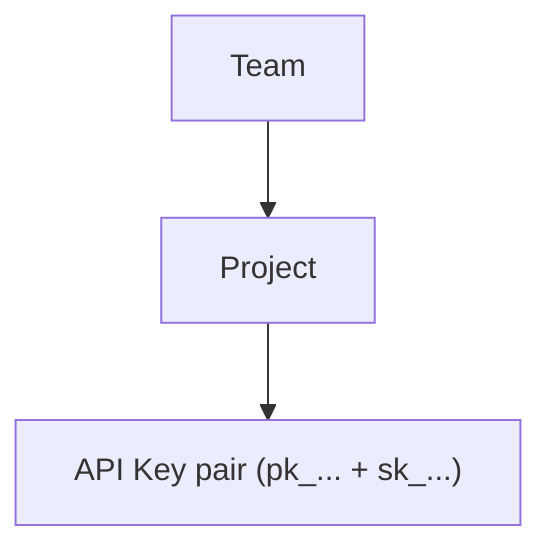
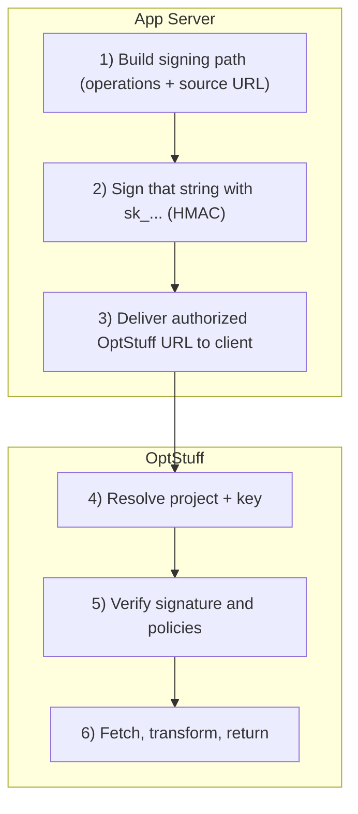

This page is the **conceptual map** for OptStuff: what the product is optimizing for, which abstractions exist and why, how a request is authorized, and how policy layers stack. For the concrete HTTP pipeline (parse → verify → rate limit → domains → fetch), see [How It Works](/introduction/how-it-works). For step-by-step signing math and examples, see [URL Signing](/guides/url-signing).

## What OptStuff Is

OptStuff is a **secure image transformation service**.

You provide:

- A **source image URL** (where the original bytes live)
- A set of **transformation operations** (for example width, format, quality)

OptStuff returns:

- An **optimized image** that matches those operations

The design centers on one idea: **transformations are not an open API**. They are expressed as a **signed URL** that only your backend can mint. OptStuff validates that contract on every request before it fetches or transforms anything.

## Why This Architecture Exists

**What teams often did before:** the frontend (or shared UI code) chose sizes and formats directly — hardcoded `src` URLs, query strings on a public CDN or proxy, or `next/image` loaders that rewrite paths without a server trust boundary. Sometimes signing secrets or “resize tokens” ended up in client bundles to skip a backend round-trip.

**Why that hurts:** parameters are easy to tamper with or enumerate, behavior drifts across apps, and you cannot consistently enforce who may request which source from where. Auditing usage and revoking access is painful when the contract lives in scattered frontend logic.

**How OptStuff addresses it:** your server holds **`sk_...`** and issues **authorized URLs**. **Project policy** (allowed caller/source domains, keys, limits) applies to every request, so delivery stays predictable and governable.

**Compared to frontend-direct delivery:**

| | Frontend-direct | OptStuff (signed, backend-issued URLs) |
|---|-----------------|----------------------------------------|
| **Pros** | Simple to ship first; no signing in the hot path for prototypes | Tamper-resistant params; centralized policy; consistent transforms; better auditability |
| **Cons** | Weak or duplicated governance; secret-in-client risks; inconsistent behavior across surfaces | Requires a signing step and safe storage of `sk_...`; slightly more moving parts than a bare CDN URL |

**What value that bundles:** not only smaller images (performance), but also **one transformation model** across apps (product), **only server-signed requests accepted** (security), and **visibility and control** at project/key level (operations).

## Teams, Projects, and API Keys

OptStuff separates **who owns configuration** from **what each HTTP request is allowed to do**.



### Team

Organizational ownership and admin boundary (billing, members, projects).

### Project

A **runtime policy boundary** for one app or environment: which **source domains** may be fetched, which **caller contexts** (for example Referer) are acceptable, and how keys for that slice of traffic are scoped.

### API Key Pair

| Component | Purpose | Exposure |
|-----------|---------|----------|
| `pk_...` | Request identity (`key` query param) | Public (appears in URLs the client may see) |
| `sk_...` | Proves the URL was minted by you (`sig`) | **Server-only** — never in the browser or mobile bundles |

The split is deliberate: the client can carry **identity** (`pk_...`) without carrying **signing authority** (`sk_...`).

## The Signed URL as the Contract

Every allowed transformation is encoded in a single URL shape. Conceptually, it answers: *which project*, *which operations*, *which source*, *which key*, and *whether the server authorized this exact combination*.

```text
https://<base>/api/v1/<projectSlug>/<operations>/<source>?key=<pk_...>&exp=<optional>&sig=<signature>
```

| Part | Meaning |
|------|--------|
| `<projectSlug>` | Which **project** (and thus which policy) applies |
| `<operations>` | **What** to do to the image (resize, format, quality, …) |
| `<source>` | **Which** origin image to fetch |
| `key` | Which **public key** this request is attributed to |
| `exp` | Optional **time bound** so old links can expire without rotating `sk_...` |
| `sig` | Cryptographic proof that a holder of **`sk_...`** approved the signing input for this `key` |

Under the hood, `sig` is an **HMAC** over a defined signing string that binds path, operations, source, expiry, and key identity. The exact string, encoding, and edge cases are in [URL Signing](/guides/url-signing) — you do not need those bytes on this page to understand the model: **if `sig` does not verify, OptStuff does not treat the request as authorized.**

## Runtime Trust Model

At runtime, **your app server** and **OptStuff** play distinct roles: one **mints** authority, the other **verifies** it and enforces policy.



**How the URL reaches the browser** (step 3) is an integration choice, not part of OptStuff's core contract:

- **Direct**: embed the full URL in HTML, JSON, or similar.
- **Via your backend**: a route signs and returns a **redirect** or a URL string; the browser then issues an ordinary **GET** to OptStuff's `/api/v1/...` with `key` and `sig` (and optional `exp`).

**Invariant:** OptStuff does **not** honor arbitrary transformation parameters from an untrusted client. **Authorization-by-signature** means unsigned or tampered requests are rejected regardless of how pretty the path looks.

## Permission Layers (Fail Closed)

Validation is layered so that each stage can deny the request before expensive work. Together they express: *is this key still valid, was this URL legitimately signed, is this caller/source allowed, and is usage within limits?*

```text
Layer 1: Team / project ownership (who may administer configuration)
Layer 2: Project policy (caller + source domain allowlists)
Layer 3: API key policy (expiry, revocation, rate limits)
Layer 4: Request integrity (signature verification + optional exp / TTL)
```

These layers are designed to **fail closed**: when any check fails, the request is denied. Configuration patterns for domains are in [Domain Whitelisting](/guides/domain-whitelisting); referer behavior in [Referer Security Model](/guides/referer-security-model); limits in [Rate Limiting](/guides/rate-limiting).

## What You Need to Use the Service

In production, four things must all be true:

1. **A policy boundary** — a project with domain rules (`allowedRefererDomains`, `allowedSourceDomains`) that match how your app and images are hosted.
2. **A trust boundary** — an API key pair with **`sk_...` only on the server**.
3. **A signing step** — backend code that builds the signing input and produces `sig` (see [URL Signing](/guides/url-signing)).
4. **A delivery path** — the client must eventually **GET** a signed `/api/v1/...` URL (embedded, returned from your API, or after a redirect).

If any one is missing, requests are either rejected or you have accidentally removed the security property OptStuff is built around.

## Next Steps

- [How It Works](/introduction/how-it-works): Request lifecycle and validation order
- [URL Signing](/guides/url-signing): Payload, `exp`, and HMAC details
- [Domain Whitelisting](/guides/domain-whitelisting): Policy configuration patterns
- [Custom next/image Loader](/guides/nextjs-image-loader): `next/image` with signing and redirect
- [Quick Start](/getting-started/quickstart): End-to-end implementation walkthrough
