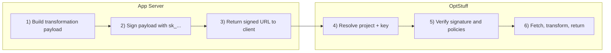
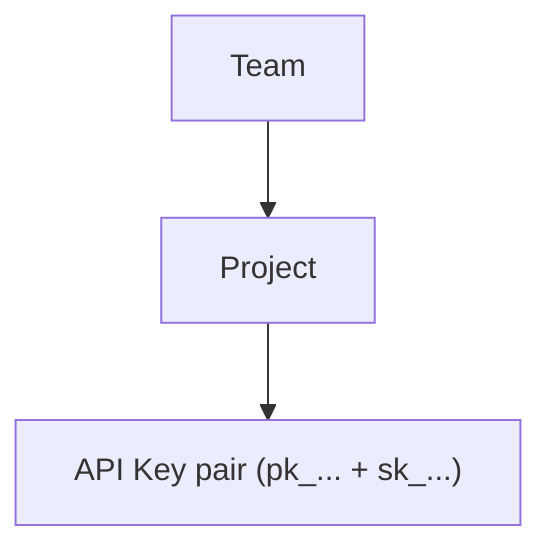

This page explains the core service model of OptStuff: what value it provides, how it works, and what conditions must be in place for it to operate safely.

## What OptStuff Is

OptStuff is a secure image transformation service.

You provide:

- A source image URL
- A set of transformation operations (for example width, format, quality)

OptStuff returns:

- An optimized image response that matches those operations

In short, OptStuff turns image delivery into a controllable backend capability instead of ad-hoc frontend logic.

## What Value It Provides

OptStuff's value is not only "resize images". It combines delivery, control, and governance:

1. **Performance value**: smaller and format-appropriate images improve page speed.
2. **Product value**: one transformation model across all apps and environments.
3. **Security value**: only server-signed requests are accepted.
4. **Operational value**: usage visibility and policy control at project/key level.

## How the Service Works

At runtime, OptStuff follows this trust model:



The critical idea is authorization-by-signature:

- OptStuff does not trust raw transformation parameters from clients.
- OptStuff trusts requests only when `sig` proves the URL was signed with the correct secret key.

## Core Concepts and Why They Exist

OptStuff resources are organized as:



### Team

Represents organizational ownership and management boundary.

### Project

Represents a runtime policy boundary for one app or environment.
Project-level settings decide which callers and source domains are allowed.

### API Key Pair

| Component | Purpose | Exposure |
|-----------|---------|----------|
| `pk_...` | Request identity (`key`) | Public |
| `sk_...` | Signature generation (`sig`) | Server-only |

This split allows public request identification without exposing signing authority.

## What a User Needs to Use the Service

To use OptStuff in production, users need four things in place:

1. **A policy boundary**: a project with domain rules (`allowedRefererDomains`, `allowedSourceDomains`).
2. **A trust boundary**: an API key pair where `sk_...` is stored only on the server.
3. **A signing step**: backend code that creates signed URLs.
4. **A delivery path**: client/app code that requests images through those signed URLs.

If any one of these is missing, requests are either rejected or insecure.

## Signed URL as a Service Contract

A signed URL is the contract between your app and OptStuff:

```text
https://<base>/api/v1/<projectSlug>/<operations>/<source>?key=<pk_...>&exp=<optional>&sig=<signature>
```

Each part answers one question:

- `<projectSlug>`: which project policy should apply?
- `<operations>`: what transformation is requested?
- `<source>`: which origin image is requested?
- `key`: which public identity is used?
- `sig`: was this request authorized by server-side signing? See [URL Signing](/guides/url-signing) for signing steps and payload details.

## Permission Layers

```text
Layer 1: User and team ownership
Layer 2: Project policy (caller/source domain allowlists)
Layer 3: API key policy (rate limits)
Layer 4: Request signature validation (sig + exp/TTL checks)
```

These layers are designed to fail closed: when validation fails, the request is denied.

## Next Steps

- [How It Works](/introduction/how-it-works) — Detailed request lifecycle and validation order
- [URL Signing](/guides/url-signing) — Signature payload and HMAC details
- [Domain Whitelisting](/guides/domain-whitelisting) — Policy configuration patterns
- [Quick Start](/getting-started/quickstart) — End-to-end first implementation
