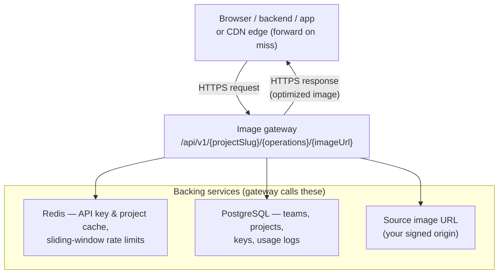
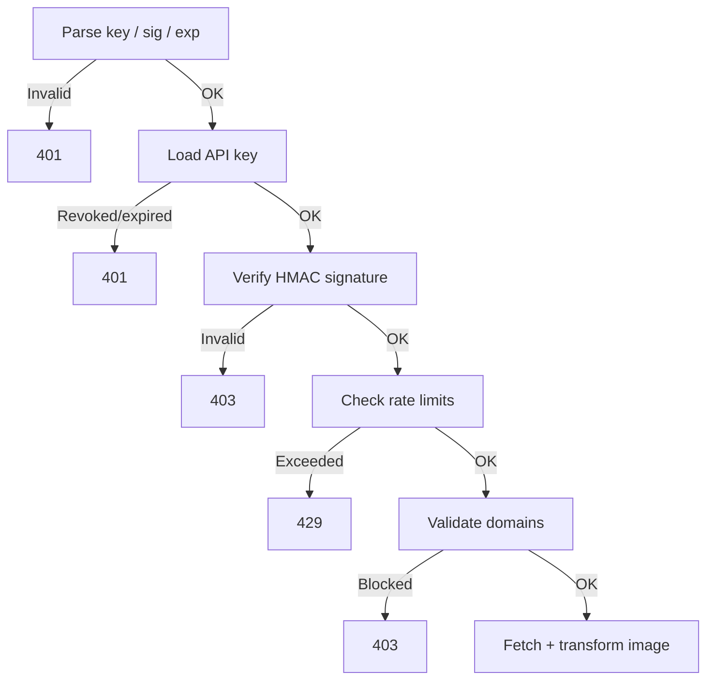
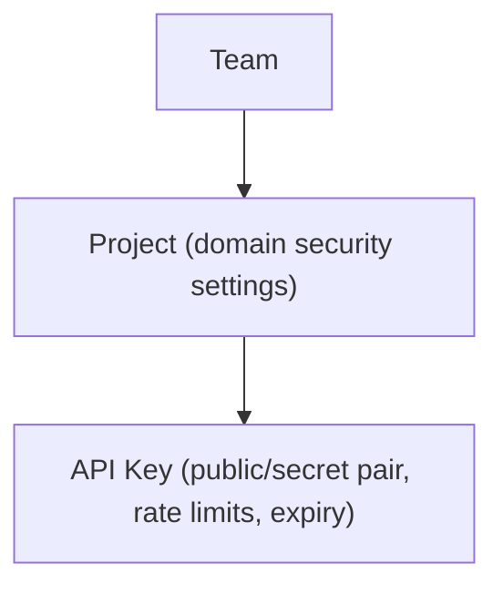

This page gives you a high-level understanding of how OptStuff processes requests so you can reason about behavior, performance, and security before integrating.

For product-level concepts, see [What is OptStuff?](/docs). For the full implementation deep-dive, see [Architecture Overview](/architecture/overview).

## Architecture At A Glance

A request hits the **image gateway** (the `/api/v1/...` HTTP handler). The gateway talks to Redis and PostgreSQL for auth, settings, and limits, fetches the source image from the URL you signed, runs transforms, then **returns the bytes in the HTTP response** (the diagram’s arrow back to the client means “response”, not a separate outbound connection).

**Who is the HTTP client?** Any HTTP client can call the signed URL: **browsers**, **native or desktop apps**, or **your own backend** (for example generating Open Graph images, PDFs, or thumbnails in a job). If you put a **CDN in front of OptStuff**, visitors still hit the CDN first; on a **cache miss** the CDN edge **forwards** the same GET to OptStuff—so from the gateway’s perspective the inbound TCP connection can be the CDN, not the end user’s device. See [CDN and Caching](/guides/cdn-caching).

The table is the same system as the diagram: the gateway is the box in the middle; Redis covers both **config cache** and **rate limiter**; fetching and transforming happen inside the gateway after checks pass (Sharp / IPX).

| Component | In the diagram | What it does |
|-----------|----------------|--------------|
| **Image gateway** | Center box | Validates auth, signature, operations, rate limits, and domain rules; fetches source, transforms, returns the image |
| **Config cache** | Redis | Caches API key and project settings for fast lookups |
| **Rate limiter** | Redis (same store) | Enforces sliding-window per-day and per-minute limits per API key |
| **Image engine** | Inside gateway (+ line to origin) | Fetches the source image and applies transformations (IPX / Sharp) |

## Request Flow

Every image request goes through a strict validation pipeline before the image is processed:

Key design decisions:

- **Signature before rate limiting** — unauthenticated requests cannot consume quota
- **Domain checks before fetch** — enforces explicit source boundaries before any outbound request

## Security Boundaries

| Layer | What It Protects |
|-------|------------------|
| **Signed URLs (HMAC-SHA256)** | Prevents unauthorized URL forging |
| **Source domain allowlist** | Controls which image origins can be fetched |
| **Referer allowlist** | Mitigates browser hotlinking |
| **Key expiry / revocation** | Invalidates stale or compromised credentials |
| **Rate limiting** | Limits abuse and accidental bursts |

## Data Model

Each level adds its own access control. For details on the resource hierarchy, see [Core Concepts](/introduction/core-concepts).

## What Happens When Things Fail

| Scenario | Behavior |
|----------|----------|
| **Redis unavailable** | Rate limiter fails open (requests allowed), prioritizing availability |
| **Setting changes** | Propagate within ~60s via cache TTL |
| **Source URL logging** | Query strings and hashes are sanitized for privacy |

For the complete architecture deep-dive, see [Architecture Overview](/architecture/overview).

## Related Docs

- [Quick Start](/getting-started/quickstart) — Get your first optimized image
- [API Endpoint](/api-reference/endpoint) — Full endpoint reference
- [Security Best Practices](/guides/security-best-practices) — Defense-in-depth recommendations
