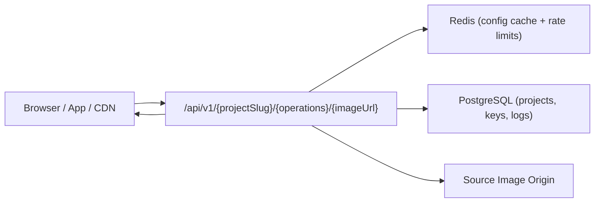
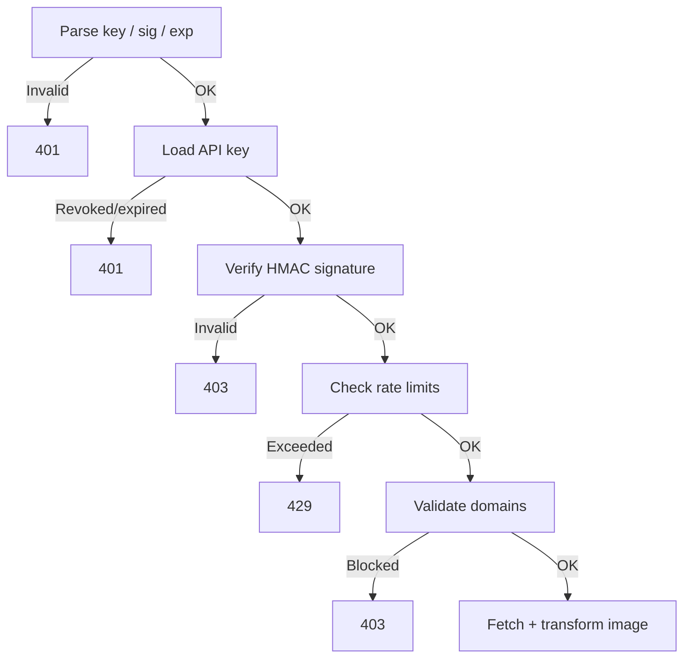

This page gives you a high-level understanding of how OptStuff processes requests so you can reason about behavior, performance, and security before integrating.

For product-level concepts, see [What is OptStuff?](/docs). For the full implementation deep-dive, see [Architecture Overview](/architecture/overview).

## Architecture At A Glance



| Component | What It Does |
|-----------|-------------|
| **Image Gateway** | Validates auth, signature, operations, rate limits, and domain rules; returns optimized image |
| **Config Cache** | Caches API key and project settings in Redis for fast lookups |
| **Rate Limiter** | Sliding-window per-day and per-minute limits per API key |
| **Image Engine** | Fetches source image and applies transformations (IPX/Sharp) |

## Request Flow

Every image request goes through a strict validation pipeline before the image is processed:



Key design decisions:

- **Signature before rate limiting** — unauthenticated requests cannot consume quota
- **Domain checks before fetch** — enforces explicit source boundaries before any outbound request

## Security Boundaries

| Layer | What It Protects |
|-------|------------------|
| **Signed URLs (HMAC-SHA256)** | Prevents unauthorized URL forging |
| **Source domain allowlist** | Controls which image origins can be fetched |
| **Referer allowlist** | Mitigates browser hotlinking |
| **Key expiry / revocation** | Invalidates stale or compromised credentials |
| **Rate limiting** | Limits abuse and accidental bursts |

## Data Model

```text
Team
 └── Project (domain security settings)
      └── API Key (public/secret pair, rate limits, expiry)
```

Each level adds its own access control. For details on the resource hierarchy, see [Core Concepts](/introduction/core-concepts).

## What Happens When Things Fail

| Scenario | Behavior |
|----------|----------|
| **Redis unavailable** | Rate limiter fails open (requests allowed), prioritizing availability |
| **Setting changes** | Propagate within ~60s via cache TTL |
| **Source URL logging** | Query strings and hashes are sanitized for privacy |

For the complete architecture deep-dive, see [Architecture Overview](/architecture/overview).

## Related Docs

- [Quick Start](/getting-started/quickstart) — Get your first optimized image
- [API Endpoint](/api-reference/endpoint) — Full endpoint reference
- [Security Best Practices](/guides/security-best-practices) — Defense-in-depth recommendations
