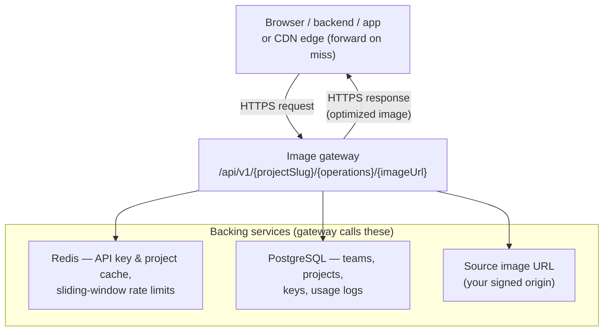
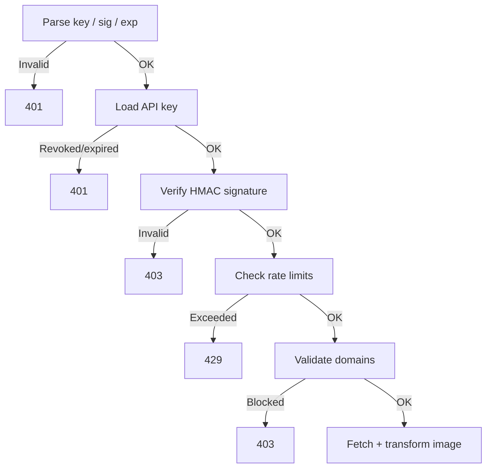
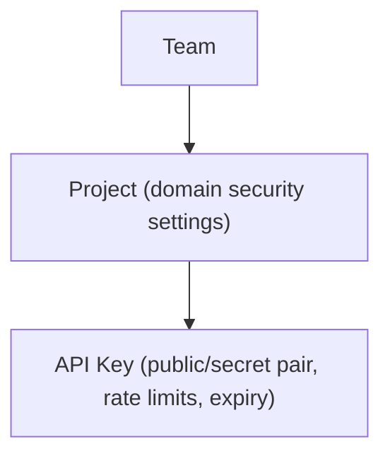

This page gives you a high-level understanding of how OptStuff processes requests so you can reason about behavior, performance, and security before integrating.

For product-level concepts, see [What is OptStuff?](/docs). For the full implementation deep-dive, see [Architecture Overview](/architecture/overview).

## Architecture At A Glance

A signed image URL is fetched with **one HTTPS round trip**: the client sends a `GET`, and the **same connection** carries back optimized bytes (or an error). The diagram is the **map** (which boxes exist and who calls whom). The subsections **below the diagram follow that map in reading order**—use them as the legend. For the **ordered validation pipeline** (not shown as separate boxes here), see [Request Flow](#request-flow).

### Client (both sides of the client node)

Whoever opens TLS to your deployment: a **browser**, **app**, **your backend**, or a **CDN edge** that forwards on cache miss ([CDN and Caching](/guides/cdn-caching)). They issue the signed `GET` and read the response—not a separate OptStuff-hosted “client” service.

### Image gateway (center box)

The `/api/v1/...` **handler** ties the diagram together: it consults Redis and Postgres for **policy and limits**, and only when checks pass does it **fetch** the embedded source URL and run **IPX / Sharp** in the **same process**. The arrow back to the client is the **HTTP response** on that request, not a new outbound connection to the browser.

### Redis (one box, two jobs)

Redis appears once in the figure but covers **two concerns**:

- **Config cache (cache-aside):** Hot **project** and **API key** rows (domains, key metadata, **encrypted** secret material as stored in Redis, expiry/revocation, rate-limit **settings**). Typical positive TTL **~60s**, plus a short **negative cache** for unknown keys. Key names, invalidation, and serialization: [Redis Schema](/architecture/redis-schema).
- **Rate limits:** **Sliding-window** counters per **public key** (minute + day buckets). Over limit → **`429`**. These use **different Redis keys** than the config JSON blobs.

### PostgreSQL (backing box)

**Source of truth** for teams, projects, API keys, and related operational data. The gateway reads through the **config cache** first; **misses** and **writes** hit Postgres.

### Source URL and transforms (arrow to origin; execution inside the gateway)

The signed path carries a **remote image URL** (often your **CDN or origin**). The gateway **HTTP(S)-fetches** it **only after** signature, limits, and domain rules succeed. Decoding, **width / format / quality**, and re-encoding happen **in that handler**—there is no second OptStuff hop for “the image engine.”

## Request Flow

Every image request goes through a strict validation pipeline before the image is processed:

Key design decisions:

- **Signature before rate limiting** — unauthenticated requests cannot consume quota
- **Domain checks before fetch** — enforces explicit source boundaries before any outbound request

## Security Boundaries

| Layer | What It Protects |
|-------|------------------|
| **Signed URLs (HMAC-SHA256)** | Prevents unauthorized URL forging |
| **Source domain allowlist** | Controls which image origins can be fetched |
| **Referer allowlist** | Mitigates browser hotlinking |
| **Key expiry / revocation** | Invalidates stale or compromised credentials |
| **Rate limiting** | Limits abuse and accidental bursts |

## Data Model

Each level adds its own access control. For details on the resource hierarchy, see [Core Concepts](/introduction/core-concepts).

## What Happens When Things Fail

| Scenario | Behavior |
|----------|----------|
| **Redis unavailable** | Rate limiter fails open (requests allowed), prioritizing availability |
| **Setting changes** | Propagate within ~60s via cache TTL |
| **Source URL logging** | Query strings and hashes are sanitized for privacy |

For the complete architecture deep-dive, see [Architecture Overview](/architecture/overview).

## Related Docs

- [Quick Start](/getting-started/quickstart) — Get your first optimized image
- [API Endpoint](/api-reference/endpoint) — Full endpoint reference
- [Security Best Practices](/guides/security-best-practices) — Defense-in-depth recommendations
