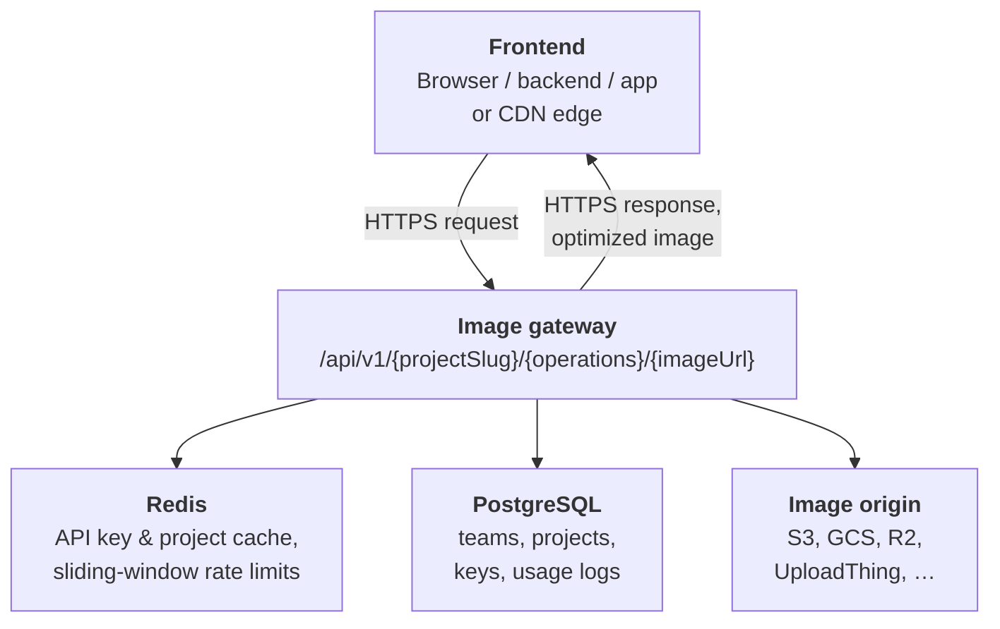
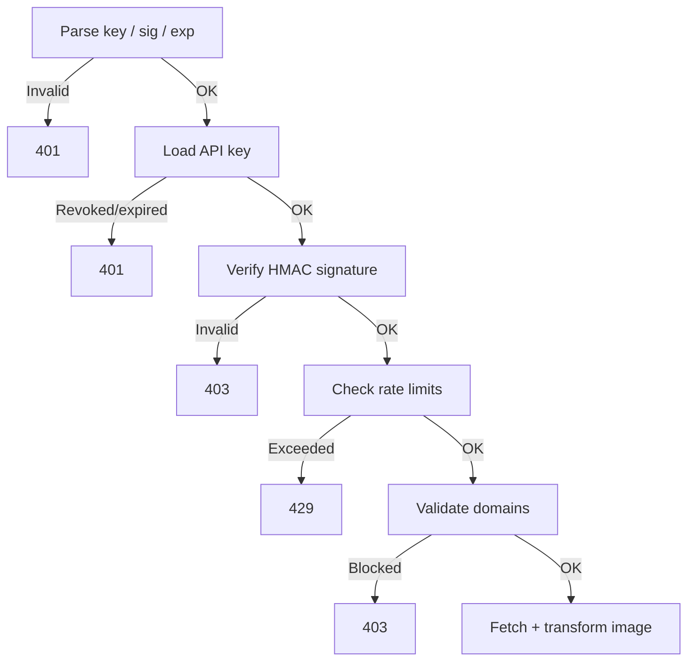
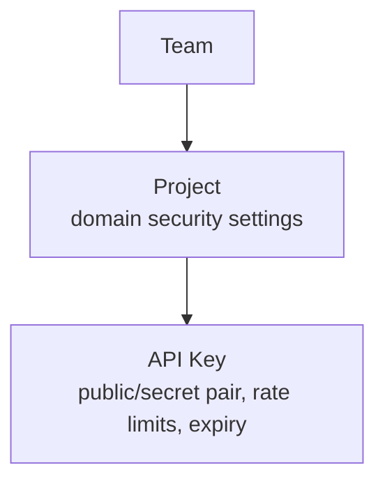

This page gives you a high-level understanding of how OptStuff processes requests so you can reason about behavior, performance, and security before integrating.

For product-level concepts, see [What is OptStuff?](/docs). For the full implementation deep-dive, see [Architecture Overview](/architecture/overview).

## Who calls whom on one GET

A signed image URL is fetched with **one HTTPS round trip**: the client sends a `GET`, and the **same connection** carries back optimized bytes or an error. The diagram is the **map**: it shows which boxes exist and who calls whom. The subsections **below the diagram** follow that map in reading order; use them as the legend. This figure does not break out the **ordered validation pipeline** as separate boxes; for that, see [Request Flow](#request-flow).

### Client

Whoever opens TLS to your deployment: a **browser**, **app**, **your backend**, or a **CDN edge** in front of OptStuff (return cached optimized bytes or forward the signed `GET` on miss). That tier is **not Image origin**—the infrastructure that serves the **original** bytes (see the figure). See [CDN and Caching](/guides/cdn-caching). There is no separate OptStuff-hosted “client” service—these are just callers that consume the HTTP response.

### Image gateway

The `/api/v1/...` **handler** ties the diagram together: it consults Redis and Postgres for **policy and limits**, and only when checks pass does it **fetch** the embedded source URL and run **IPX / Sharp** in the **same process**. The arrow back to the client is the **HTTP response** on that request, not a new outbound connection to the browser.

### Redis

Redis appears once in the figure but covers **two concerns**:

- **Config cache, cache-aside:** Hot **project** and **API key** rows: domains, key metadata, **encrypted** secret material as stored in Redis, expiry and revocation, and rate-limit **settings**. Typical positive TTL **~60s**, plus a short **negative cache** for unknown keys. Key names, invalidation, and serialization: [Redis Schema](/architecture/redis-schema).
- **Rate limits:** **Sliding-window** counters per **public key** in minute and day buckets. Over limit → **`429`**. These use **different Redis keys** than the config JSON blobs.

### PostgreSQL

**Source of truth** for teams, projects, API keys, and related operational data. The gateway reads through the **config cache** first; **misses** and **writes** hit Postgres.

### Image origin

**Image origin** is **your** storage or delivery stack—not OptStuff. The gateway reaches it with an outbound `GET` to the **remote URL embedded in the signed OptStuff path**—typically **object storage** (for example S3, GCS, or R2), a **hostname that delivers the original file** (often **CloudFront**, **Cloudflare**, or another **CDN** layered on the bucket), or an **upload host** (for example UploadThing). That URL may be public, presigned, or otherwise reachable over HTTP or HTTPS; it is not the OptStuff image URL itself.

The gateway starts that fetch **only after** the **signature**, **rate limits**, and **domain rules** succeed. It loads the image over **HTTP or HTTPS**, decodes it, applies **width**, **format**, and **quality** from the path, and re-encodes the result **in the same handler** as the rest of the work. There is no second hop through OptStuff for a separate “image engine”; one client request yields one gateway response with the optimized bytes.

## Request Flow

Every image request goes through a strict validation pipeline before the image is processed:

Key design decisions:

- **Signature before rate limiting** — unauthenticated requests cannot consume quota
- **Domain checks before fetch** — enforces explicit source boundaries before any outbound request

## Security Boundaries

| Layer | What It Protects | Read more |
|-------|------------------|-----------|
| **Signed URLs, HMAC-SHA256** | Prevents unauthorized URL forging | [Read more](/guides/url-signing) |
| **Source domain allowlist** | Controls which image origins can be fetched | [Read more](/guides/domain-whitelisting) |
| **Referer allowlist** | Mitigates browser hotlinking | [Read more](/guides/referer-security-model) |
| **Key expiry / revocation** | Invalidates stale or compromised credentials | [Read more](/guides/key-management) |
| **Rate limiting** | Limits abuse and accidental bursts | [Read more](/guides/rate-limiting) |

## Data Model

Each level adds its own access control. For details on the resource hierarchy, see [Core Concepts](/introduction/core-concepts).

## What Happens When Things Fail

| Scenario | Behavior |
|----------|----------|
| **Redis unavailable** | Rate limiter fails open so requests are still allowed, prioritizing availability |
| **Setting changes** | Propagate within ~60s via cache TTL |
| **Source URL logging** | Query strings and hashes are sanitized for privacy |

For the complete architecture deep-dive, see [Architecture Overview](/architecture/overview).

## Related Docs

- [Quick Start](/getting-started/quickstart) — Get your first optimized image
- [API Endpoint](/api-reference/endpoint) — Full endpoint reference
- [Security Best Practices](/guides/security-best-practices) — Defense-in-depth recommendations
