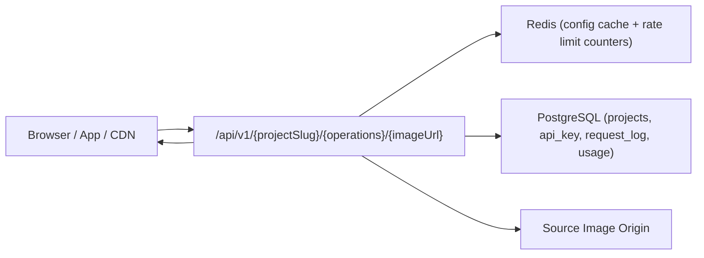
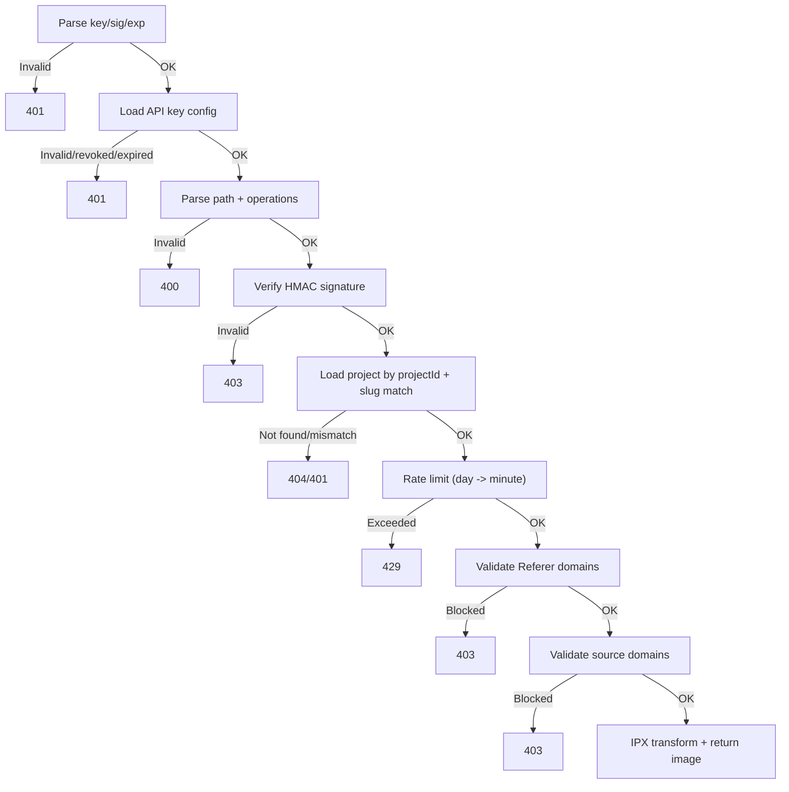
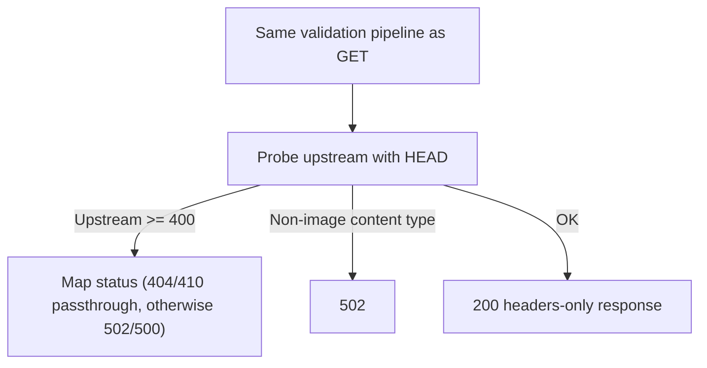

This page explains how OptStuff is built end-to-end so you can reason about behavior, performance, and security before integrating at scale.

For product-level concepts, see [What is OptStuff?](/introduction/what-is-optstuff). For setup, see [Quick Start](/getting-started/quickstart).

## Architecture At A Glance



### Main Components

| Component | Responsibility |
|-----------|----------------|
| **Image Gateway** (`/api/v1/...`) | Validates auth, signature, operations, rate limit, domain rules; serves optimized image |
| **Validation Layer** | Parses `key/sig/exp`, checks operation bounds, validates `Referer` and source domain |
| **Config Cache Layer** | Caches API key + project security settings in Redis (60s positive TTL, 10s negative TTL) |
| **Rate Limiter** | Sliding-window per-day and per-minute limits per API key |
| **Image Engine (IPX/Sharp)** | Fetches source image and applies operations (`w`, `h`, `q`, `f`, `fit`, `s`, `embed`) |
| **Observability** | Logs requests, tracks usage, and updates last-used activity in background |

## Request Flow (GET)



### Why this order matters

- **Signature before quota usage** prevents unauthenticated requests from consuming quota.
- **Project lookup by `projectId` from API key** prevents cross-project slug confusion.
- **Domain checks before fetch/transform** enforce explicit source boundaries.

## Request Flow (HEAD fast path)

`HEAD` runs the same security pipeline as `GET`, but skips transform and returns headers only.



This is useful for cheap availability checks and health probes without paying full transform cost.

## Data Model

```text
Team
 └── Project
      └── API Key
```

| Entity | Notes |
|--------|------|
| `team` | Top-level ownership boundary (personal team created during onboarding) |
| `project` | Security settings (`allowedSourceDomains`, `allowedRefererDomains`) |
| `api_key` | Public/secret pair, expiry, revocation, per-key rate-limit fields |
| `request_log` | Per-request telemetry (source URL is sanitized before storage) |
| `usage_record` | Aggregated usage metrics |

## Security Boundaries

| Layer | What it protects |
|-------|------------------|
| **Signed URLs (HMAC-SHA256)** | Prevents unauthorized URL forging |
| **Source domain allowlist** | Controls which origins can be fetched |
| **Referer allowlist** | Mitigates browser hotlinking on authorized keys |
| **Key expiry/revocation** | Invalidates stale or compromised credentials |
| **Rate limiting** | Limits abuse and accidental bursts |

## Operational Behaviors To Know

- **Redis unavailable:** rate limiter fails open (request allowed), prioritizing availability.
- **Config propagation:** cache TTL means setting changes normally propagate within ~60s.
- **Logging privacy:** request log sanitizes query/hash from source URLs.
- **Usage updates:** telemetry work runs in background after response to reduce tail latency.

## Related Docs

- [API Endpoint](/api-reference/endpoint)
- [Domain Whitelisting](/guides/domain-whitelisting)
- [Rate Limiting](/guides/rate-limiting)
- [Security Best Practices](/guides/security-best-practices)
- [Internal System Overview](/internal/system-overview)
